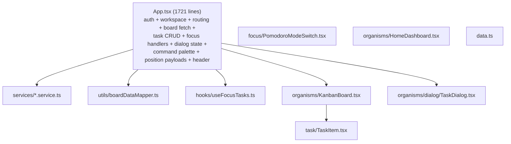
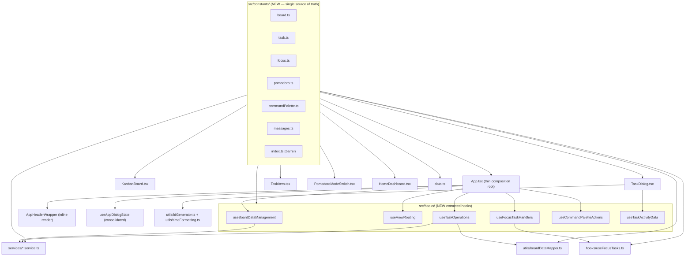

# Design Document

## Overview

This design describes a **behavior-preserving structural refactoring** of the React Kanban
codebase. The goal is to reduce complexity and duplication identified in
`REFACTORING_SPECIFICATION_REPORT.md` while keeping every externally observable behavior
identical. No new end-user features are added, and no observable output (rendered UI,
Supabase payloads, localStorage contents, routing, toast messages) changes.

The work targets five concentrations of complexity:

1. **Missing constants layer** — magic values are scattered across components, hooks,
   services, and utilities. A new `src/constants/` directory becomes the single source of truth.
2. **The `App.tsx` God Component** — verified at **1721 lines** at the time of this design
   (the requirements baseline cites 1534; the original audit says "1700+"; this design uses
   the freshly measured 1721 as the pre-refactoring count to beat). Its concerns are extracted
   into focused custom hooks.
3. **Redundant payload-building and normalization logic** in `task.service.ts`,
   `boardDataMapper.ts`, `useFocusTasks.ts`, and `App.tsx`.
4. **Oversized dialog/draft state and prop interfaces** in `App.tsx`, `TaskDialog.tsx`, and
   `KanbanBoard.tsx`.
5. **Vague identifiers** in `App.tsx`, `KanbanBoard.tsx`, and `useFocusTasks.ts`.

### Verification Model (No Test Framework)

This project exposes exactly two objective verification commands:

- `npm run build` → `tsc -b && vite build`
- `npm run lint` → `eslint .`

There is **no automated test framework configured**, and Requirement 10 explicitly forbids
inventing one to satisfy the behavioral checks. Therefore correctness is established by:

1. **`npm run build`** passing (type-level and bundle integrity) after every increment.
2. **`npm run lint`** passing with no new errors/warnings relative to the pre-refactoring
   baseline after every increment.
3. **Code review of preserved logic** — comparing the consolidated/relocated code against the
   original to confirm identical field values, defaults, key names, and control flow.
4. **Explicit manual reasoning about behavioral equivalence** for the items enumerated in
   Requirement 10 (payload shapes, localStorage, routing, drag-and-drop, CRUD, Focus Dock,
   Pomodoro/floating timer, auth/workspace/invite flows).
5. **Workspace-wide grep checks** confirming no old renamed identifier remains and no inline
   duplicate of a centralized constant remains.

Because the deliverable is a refactoring of declarative React/TypeScript composition and I/O
glue (not pure algorithmic logic with a large input space), **property-based testing does not
apply** to this feature. See the Testing Strategy section for the rationale and the
review-based plan that replaces it.

## Architecture

### Current architecture (relevant slice)



### Target architecture



The architecture stays a single-page React app with the same module boundaries
(`components/`, `hooks/`, `services/`, `utils/`). The only new top-level directory is
`src/constants/`. `App.tsx` is reduced to a composition root that wires hooks together and
selects a view by auth state and route.

### Design principles applied

- **No behavioral drift**: every extracted function returns byte-identical outputs; every
  relocated literal keeps the same value; import paths are updated atomically with moves.
- **Mechanical, reviewable changes**: each step is small enough that a reviewer can compare
  old vs new side-by-side.
- **Incremental gating**: build + lint after each step (Requirement 9), lowest-risk steps first.

## Components and Interfaces

### 1. `src/constants/` — Constants Module

A new directory holding all centralized domain constants, exported through a barrel
(`index.ts`) so callers can `import { TASK_PRIORITIES } from '../constants'`. Files are grouped
by domain to avoid a single sprawling file.

| File | Exports | Purpose |
| --- | --- | --- |
| `board.ts` | `LIST_POSITION_STEP`, `DEFAULT_BOARD_TITLE` | Board layout + seed defaults |
| `task.ts` | `TASK_PRIORITIES`, `DEFAULT_TASK_PRIORITY`, `DEFAULT_TASK_CATEGORIES` | Task domain values |
| `focus.ts` | `STORAGE_KEYS`, `MAX_FOCUS_TASKS`, `FOCUS_BUTTON_LABELS` | Focus Dock domain values |
| `pomodoro.ts` | `POMODORO_MODES` | Pomodoro mode ordering |
| `commandPalette.ts` | `COMMAND_PALETTE_ACTION_CONFIG` | Static config for command actions |
| `messages.ts` | `FOCUS_LIMIT_MESSAGE`, `ERROR_MESSAGES` | Shared user-facing strings |
| `index.ts` | re-exports all of the above | Single import surface |

#### Exported names, values, and types

```ts
// src/constants/board.ts
export const LIST_POSITION_STEP = 1000;
export const DEFAULT_BOARD_TITLE = 'HVAC Editor';

// src/constants/task.ts
import type { BoardTaskItem } from '../types/task.type';

// Typed tuple via `as const` so members are usable as a union type.
export const TASK_PRIORITIES = ['High', 'Medium', 'Low', 'Lowest'] as const;
export type TaskPriority = (typeof TASK_PRIORITIES)[number]; // 'High' | 'Medium' | 'Low' | 'Lowest'

export const DEFAULT_TASK_PRIORITY: TaskPriority = 'Low';

// Object-with-named-members form (Requirement 1.5 requires 'Design' and 'Sprint').
export const DEFAULT_TASK_CATEGORIES = {
  CATEGORY_1: 'Design',
  CATEGORY_2: 'Sprint',
} as const;

// src/constants/focus.ts
export const STORAGE_KEYS = {
  FOCUS_TASKS: 'kanban_focus_tasks',
  ACTIVE_FOCUS_TASK: 'kanban_active_focus_task',
} as const;

export const MAX_FOCUS_TASKS = 3;

export const FOCUS_BUTTON_LABELS = {
  ACTIVE: 'Focused',
  INACTIVE: 'Focus',
} as const;

// src/constants/pomodoro.ts
import type { PomodoroMode } from '../types/focus.type';

export const POMODORO_MODES: readonly PomodoroMode[] = ['focus', 'shortBreak', 'longBreak'] as const;

// src/constants/messages.ts
export const FOCUS_LIMIT_MESSAGE = 'Focus Dock supports up to 3 active tasks.';
export const ERROR_MESSAGES = {
  INVALID_TEMPLATE: 'Please choose a starter template.',
} as const;
```

```ts
// src/constants/commandPalette.ts
// Static, serializable parts of each command palette action (NO `run` closures here —
// those stay in the hook because they capture component state/handlers).
export interface CommandPaletteActionConfig {
  id: string;
  title: string;
  description: string;
  shortcut?: string;
  keywords: string[];
}

export const COMMAND_PALETTE_ACTION_CONFIG = {
  GO_HOME: { id: 'go-home', title: 'Go to Home', description: 'Open the personal dashboard.', shortcut: 'H', keywords: ['dashboard', 'my tasks', 'home'] },
  GO_TODAY: { id: 'go-today', title: 'Go to Today', description: 'Open the daily focus planning page.', shortcut: 'T', keywords: ['today', 'my day', 'daily plan', 'focus plan'] },
  GO_BOARD: { id: 'go-board', title: 'Go to Board', description: 'Open the active Kanban board.', shortcut: 'B', keywords: ['kanban', 'board', 'columns'] },
  GO_CALENDAR: { id: 'go-calendar', title: 'Go to Calendar', description: 'Open the calendar view for due dates.', shortcut: 'C', keywords: ['calendar', 'due dates', 'schedule'] },
  QUICK_ADD_TASK: { id: 'quick-add-task', title: 'Quick add task', description: 'Create a task in the first list of the active board.', shortcut: 'N', keywords: ['new task', 'create task', 'card'] },
  PLAN_TODAYS_FOCUS: { id: 'plan-todays-focus', title: "Plan today's focus", description: 'Open Today to choose up to 3 focus tasks.', keywords: ['today', 'my day', 'focus', 'plan'] },
  NEW_LIST: { id: 'new-list', title: 'Create list', description: 'Add a new column to the active board.', keywords: ['new list', 'column', 'group'] },
  NEW_BOARD: { id: 'new-board', title: 'Create board', description: 'Start another board from a template.', keywords: ['new board', 'template', 'project'] },
  START_FOCUS_TIMER: { id: 'start-focus-timer', title: 'Start focus session', description: 'Start Pomodoro for the active focus task.', keywords: ['focus', 'pomodoro', 'timer', 'start', 'session'] },
  VIEW_TODAY_FOCUS_STATS: { id: 'view-today-focus-stats', title: 'View today focus stats', description: 'Open Today to review sessions and focused minutes.', keywords: ['focus', 'stats', 'today', 'minutes', 'sessions'] },
  OPEN_FOCUS_HISTORY: { id: 'open-focus-history', title: 'Open focus history', description: 'Open the active focus task to review recent focus sessions.', keywords: ['focus', 'history', 'task detail', 'sessions'] },
  PAUSE_FOCUS_TIMER: { id: 'pause-focus-timer', title: 'Pause focus timer', description: 'Pause the current focus session.', keywords: ['focus', 'pomodoro', 'timer', 'pause'] },
  RESET_FOCUS_TIMER: { id: 'reset-focus-timer', title: 'Reset focus timer', description: 'Reset the current Pomodoro mode.', keywords: ['focus', 'pomodoro', 'timer', 'reset'] },
  POP_OUT_FOCUS_TIMER: { id: 'pop-out-focus-timer', title: 'Pop out focus timer', description: 'Open a small floating timer window.', keywords: ['focus', 'pomodoro', 'timer', 'floating', 'picture in picture'] },
} as const satisfies Record<string, CommandPaletteActionConfig>;
```

**Type-compatibility note (behavior preservation):** `TASK_PRIORITIES` is typed `as const`,
producing the union `'High' | 'Medium' | 'Low' | 'Lowest'`. Today `TaskItem.tsx` uses the inline
`(['High', 'Medium', 'Low', 'Lowest'] as const)` and `TaskDialog.tsx` types `priorityOptions` as
`Array<NonNullable<ITaskItem['priority']>>`. The new constant is assignment-compatible with both;
where a mutable array is required by an existing signature, callers spread (`[...TASK_PRIORITIES]`)
to preserve the exact current type without changing runtime values.

#### Constant-to-call-site replacement map (Requirement 1.2–1.14)

| Constant | Replaces (file : current literal) |
| --- | --- |
| `LIST_POSITION_STEP` | `App.tsx` `buildChangedListPositionPayload` `normalizedListPositionStep = 1000`; `board.service.ts` `createBoardFromTemplate` `position: index * 1000` |
| `TASK_PRIORITIES` | `TaskDialog.tsx` `priorityOptions`; `TaskItem.tsx` inline `['High','Medium','Low','Lowest']`; `boardDataMapper.ts` `normalizeTaskPriority` checks |
| `DEFAULT_TASK_PRIORITY` | `boardDataMapper.ts` `buildTaskInsertPayload`/`buildTaskUpdatePayload` `priority || 'Low'`; `task.service.ts` `?? 'Low'` (insert + update) |
| `DEFAULT_TASK_CATEGORIES` | `boardDataMapper.ts` `category1: 'Design'`, `category2: 'Sprint'` |
| `STORAGE_KEYS` | `useFocusTasks.ts` `focusTasksStorageKey`, `activeFocusTaskStorageKey` |
| `MAX_FOCUS_TASKS` | `useFocusTasks.ts` `maxFocusTasks = 3` |
| `FOCUS_LIMIT_MESSAGE` | `App.tsx` (4 `toast.info` occurrences); `useFocusTasks.ts` `setLimitMessage(...)` |
| `POMODORO_MODES` | `PomodoroModeSwitch.tsx` `pomodoroModes` |
| `FOCUS_BUTTON_LABELS` | `HomeDashboard.tsx` `{isFocused ? 'Focused' : 'Focus'}` |
| `DEFAULT_BOARD_TITLE` | `board.service.ts` (`fetchBoards` mock + `seedDefaultBoard`); `home.service.ts` `getLocalDashboardData`; `today.service.ts` `getLocalTodayData` |
| `COMMAND_PALETTE_ACTION_CONFIG` | `App.tsx` `commandPaletteActions` inline id/title/description/shortcut/keywords |
| `ERROR_MESSAGES.INVALID_TEMPLATE` | `board.service.ts` `createBoardFromTemplate` thrown message. (Note: `App.tsx` `handleCompleteOnboarding` throws the same string; it will reference the constant too.) |

**Out-of-scope literals (must NOT change):** `usePomodoroTimer.ts` `remainingSeconds * 1000`
and `Date.now() + remainingSeconds * 1000` are millisecond conversions, not list-position steps,
and are left untouched. `TaskItem.tsx` priority-dot color ternary uses `'High'`/`'Medium'`/`'Low'`
as comparison values; those comparisons remain but read against `TASK_PRIORITIES` members where it
improves clarity without changing output (the color mapping itself moves to a helper — see
Requirement 6.3).

---

### 2. Custom hooks extracted from `App.tsx` (Requirement 2)

`App.tsx` currently declares ~30 state variables, ~20 handlers, two position-payload builders,
the command-palette array, and `renderAppHeader`, then renders one of several views. The
decomposition moves cohesive concerns into hooks that return state + handlers. `App.tsx` keeps
only: top-level auth/workspace hook calls, the dialog-state object, view selection, and JSX.

The hooks are designed to **compose in the same order** the current code already runs in, so
effect timing, dependency arrays, and optimistic-update/rollback semantics are preserved.

#### 2.1 `useBoardDataManagement` (Requirement 2.1)

Owns board data, the active board id (+ ref), board summaries, loading/saving/error flags, the
board cache sync, and the fetch/refresh effects.

```ts
interface UseBoardDataManagementParams {
  authMode: AuthMode;
  activeWorkspaceId: string | null;
  userId: string | undefined;
  isAuthLoading: boolean;
  isWorkspaceLoading: boolean;
  activeView: BoardViewMode;
  initialBoardId: string | null;
  redirectToView: (view: BoardViewMode) => void; // from useViewRouting
}

interface UseBoardDataManagementResult {
  boardData: BoardData;
  setBoardData: React.Dispatch<React.SetStateAction<BoardData>>;
  activeBoardId: string | null;
  setActiveBoardId: (id: string | null) => void;
  activeBoardIdRef: React.MutableRefObject<string | null>;
  boardSummaries: BoardRow[];
  setBoardSummaries: React.Dispatch<React.SetStateAction<BoardRow[]>>;
  activeBoardSummary: BoardRow | null;
  isBoardLoading: boolean;
  setIsBoardLoading: (value: boolean) => void;
  isSavingBoard: boolean;
  setIsSavingBoard: (value: boolean) => void;
  boardErrorMessage: string | null;
  refreshBoardData: (args?: { boardId?: string | null; showErrorToast?: boolean }) => Promise<void>;
  refreshBoardList: () => Promise<BoardRow[]>;
  syncBoardCache: (boardId: string | null, boardData: BoardData) => void;
}
```

Encapsulates: `readBoardCache` initialization, `refreshBoardData`, `refreshBoardList`,
`syncBoardCache`, the `activeBoardIdRef` mirror effect, the main fetch effect, the
board-cache-write effect, `useTaskRealtime`, and `useDueDateReminder`. `App.tsx` consumes the
returned values and passes setters into the other hooks that need them (task ops, focus handlers).

#### 2.2 `useViewRouting` (Requirement 2.2)

Owns `activeView`, `activeInviteToken`, URL history sync, and `popstate` handling.

```ts
interface UseViewRoutingResult {
  activeView: BoardViewMode;
  activeInviteToken: string | null;
  activeBoardTab: BoardTabId;            // 'calendar' when view === 'calendar', else 'board'
  setActiveViewWithPath: (view: BoardViewMode, options?: { inviteToken?: string | null }) => void;
  setActiveInviteToken: (token: string | null) => void;
  initialBoardId: string | null;        // derived from board cache for first fetch
}
```

Encapsulates: `getInitialView`, `getInviteTokenFromPath`, `setActiveViewWithPath`, and the
`popstate` effect. Path → view mapping is moved verbatim to preserve Requirement 8.4 routing.

#### 2.3 `useTaskOperations` (Requirement 2.3)

Owns task create/update/delete/move plus board position persistence. Receives board state and
setters from `useBoardDataManagement` and identity context (workspace, user) so behavior is
unchanged.

```ts
interface UseTaskOperationsResult {
  onSubmitCard: (formData: TaskDialogFormData) => Promise<void>;
  onSubmitEditTask: (formData: TaskDialogFormData) => Promise<void>;
  handleDeleteConfirm: () => Promise<void>;
  handleUpdateTask: (taskId: string, fields: Partial<ITaskItem>) => Promise<void>;
  handleBoardPositionChange: (                       // renamed from handleBoardDataChange (Req 7.1)
    nextBoardData: BoardData,
    changeType: 'list' | 'task',
    activity?: { taskId: string; description: string },
  ) => Promise<void>;
}
```

Encapsulates: `onSubmitCard`, `onSubmitEditTask`, `handleDeleteConfirm` (with its optimistic
update + rollback), `handleUpdateTask` (optimistic + activity logging), `handleBoardPositionChange`,
and the two position-payload builders (`buildChangedTaskPositionPayload`,
`buildChangedListPositionPayload`) consolidated per Requirement 3.1. The editing-task selection
(`editingTask`, `isEditModalOpen`) is owned by the dialog-state hook; relevant setters are passed in.

#### 2.4 `useFocusTaskHandlers` (Requirement 2.4)

Consolidates the four duplicated focus-toggle handlers and their input-builder duplication.

```ts
interface UseFocusTaskHandlersParams {
  boardData: BoardData;
  activeBoardId: string | null;
  activeBoardSummary: BoardRow | null;
  focusTasksApi: ReturnType<typeof useFocusTasks>;   // toggleFocusTask, pinFocusTask, isFocusTask, setActiveFocusTaskId
  pomodoro: { startTimer: (id?: string) => void; setActiveTimerTaskId: (id: string | null) => void };
  setIsFocusDockCollapsed: (value: boolean) => void;
}

interface UseFocusTaskHandlersResult {
  handleToggleFocusTask: (task: ITaskItem) => void;
  handleToggleFocusTaskFromHome: (taskSummary: HomeTaskSummary) => void;
  handleToggleFocusTaskFromToday: (taskSummary: TodayTaskSummary) => void;
  handleStartFocusTaskFromToday: (taskSummary: TodayTaskSummary) => void;
}
```

Encapsulates: `getTaskListContext`, `buildFocusTaskInput`, `buildFocusTaskInputFromTodayTask`,
the `HomeTaskSummary`/`TodayTaskSummary` fallback-task construction, and the four handlers. The
shared "if not toggled, show limit toast" branch references `FOCUS_LIMIT_MESSAGE`.

#### 2.5 `useCommandPaletteActions` (Requirement 2.5)

Builds the `CommandPaletteAction[]` by combining the static `COMMAND_PALETTE_ACTION_CONFIG` with
live `run` closures. Returns the memoized array with the exact same dependency list and the same
conditional inclusion of the picture-in-picture action.

```ts
function useCommandPaletteActions(args: {
  setActiveViewWithPath: (view: BoardViewMode) => void;
  handleQuickAddTask: () => void;
  openGroupDialog: () => void;
  openCreateBoardDialog: () => void;
  handleStartFocusTimer: () => void;
  pauseTimer: () => void;
  resetTimer: () => void;
  handleOpenFloatingFocusTimer: () => void;
  handleOpenFocusTask: (task: FocusTask) => void;
  activeFocusTask: FocusTask | null;
  isPictureInPictureSupported: boolean;
}): CommandPaletteAction[];
```

Each action is assembled as `{ ...COMMAND_PALETTE_ACTION_CONFIG.GO_HOME, run: () => setActiveViewWithPath('home') }`,
preserving id/title/description/shortcut/keywords and behavior. May live as a hook in
`src/hooks/useCommandPaletteActions.ts` (the design chooses a hook, since `run` closures need
component scope).

#### 2.6 `useAppDialogState` — dialog-state consolidation (Requirement 4.1)

Consolidates the six boolean dialog flags plus the related selection state into one structured
object with named open/close helpers.

```ts
interface AppDialogState {
  taskDialog: { isOpen: boolean; mode: 'create' | 'edit'; activeListId: string | null; editingTask: ITaskItem | null };
  groupDialog: { isOpen: boolean };
  boardDialog: { isOpen: boolean };
  activityDialog: { isOpen: boolean };
  membersDialog: { isOpen: boolean };
}

interface UseAppDialogStateResult {
  dialogState: AppDialogState;
  openCreateTaskDialog: (listId: string) => void;     // was setActiveListId + setIsModalOpen(true)
  openEditTaskDialog: (task: ITaskItem) => void;       // was setEditingTask + setIsEditModalOpen(true)
  closeTaskDialog: () => void;                          // clears both create/edit + activeListId + editingTask
  openGroupDialog: () => void;  closeGroupDialog: () => void;
  openCreateBoardDialog: () => void;  closeCreateBoardDialog: () => void;
  openActivityDialog: () => void;  closeActivityDialog: () => void;
  openMembersDialog: () => void;  closeMembersDialog: () => void;
}
```

The current `TaskDialog` `isOpen` is `isModalOpen || isEditModalOpen`, with edit-vs-create chosen
by `isEditModalOpen`. The consolidated model expresses this as `taskDialog.isOpen` plus
`taskDialog.mode === 'edit'`, preserving the exact same open/submit/close behavior (Requirement 4.5).

#### What stays in `App.tsx` (Requirement 2.7)

- The top-level hook calls (`useAuth`, `useWorkspaceSession`, `useWorkspaceMembers`,
  `useFocusTasks`, `usePomodoroTimer`, `useDocumentPictureInPicture`, the new hooks).
- The early-return view selection by auth state (loading → auth → onboarding → invite) and the
  route-based view rendering (`today`, `home`, default board/calendar).
- `sharedDialogs` JSX and the `AppHeaderWrapper` render.
- Small glue handlers that are purely view-orchestration (e.g. `handleOpenBoardFromHome`,
  `handleOpenTaskFromHome`, `handleOpenFocusTask`, `handleMarkFocusTaskDone`, Pomodoro logging
  callbacks). These remain because they coordinate multiple hooks; they may be passed into the
  hooks above as needed. The net effect must be `App.tsx` < 1721 lines (Requirement 2.6 / 10.3).

---

### 3. Service and mapper consolidation

#### 3.1 `task.service.ts` — unified normalization (Requirement 3.2)

`buildStableTaskInsertPayload` and `buildStableTaskUpdatePayload` apply the same default-coalescing
(`description ?? ''`, `priority ?? 'Low'`, `start_date ?? null`, etc.). They differ in that insert
always emits all fields while update emits a field only when its key is present in the input.

Design: a single field-normalizer table drives both. A helper `normalizeTaskField(key, value)`
applies the canonical coalescing per field; insert maps all fields, update maps only
`key in taskData` fields. This guarantees identical output values for equivalent inputs
(Requirement 3.8) while preserving the insert-vs-update key-presence difference.

```ts
function normalizeTaskData(taskData: TaskInsert): TaskInsert;          // all fields (insert path)
function normalizeTaskDataPartial(taskData: TaskUpdate): TaskUpdate;   // only present keys (update path)
// Both delegate to one shared coalescing map; DEFAULT_TASK_PRIORITY replaces 'Low'.
```

`createTask`/`updateTask` call the respective helper exactly where they call the old builders.
The local-demo (`!supabase`) branches are unchanged.

#### 3.2 `boardDataMapper.ts` — shared task defaults + dead-code removal (Requirements 3.3, 3.4)

`buildTaskInsertPayload` and `buildTaskUpdatePayload` share the trunk of
`{ title, description, priority || 'Low', start_date, due_date, assignees, image, ... }`. Design:

```ts
function applyTaskDefaults(params): {
  title; description; priority: DEFAULT_TASK_PRIORITY-coalesced; start_date; due_date;
  assignees: serializeTaskAssignees(...); image;
};
// buildTaskInsertPayload = applyTaskDefaults(...) + { board_id, list_id, position, is_done:false,
//   category1: DEFAULT_TASK_CATEGORIES.CATEGORY_1, category2: DEFAULT_TASK_CATEGORIES.CATEGORY_2 }
// buildTaskUpdatePayload = applyTaskDefaults(...) (title/description/priority/dates/assignees/image only)
```

- The dead `void attachments;` statements are **removed** from both functions (Requirement 3.4).
  `attachments` is destructured but unused; after removal, the parameter is dropped from the
  destructure (or prefixed) so lint stays clean — without changing the emitted payload (which
  never included attachments).
- `DEFAULT_TASK_PRIORITY` and `DEFAULT_TASK_CATEGORIES` replace the inline literals.
- `normalizeTaskPriority` validates against `TASK_PRIORITIES` instead of the inline string checks.

#### 3.3 `buildBoardDataFromRows` decomposition (Requirement 3.6)

Split the three map-building blocks into named pure helpers orchestrated by the original function:

```ts
function buildChecklistItemsMap(rows: TaskChecklistItemRow[]): Map<string, BoardTaskItem['checklistItems']>;
function buildLabelsMap(rows: TaskLabelRow[]): Map<string, BoardTaskItem['labels'][number]>;
function buildLabelTaskRelationships(
  linkRows: TaskLabelLinkRow[],
  labelsById: Map<string, BoardTaskItem['labels'][number]>,
): Map<string, BoardTaskItem['labels']>;

// buildBoardDataFromRows orchestrates: sort lists -> build maps -> assemble columns/list/task.
```

Sorting order (checklist by `position`, tasks by `position`, lists by `position`) and the
final assembly loop are preserved exactly, so the produced `BoardData` is identical.

#### 3.4 `board.service.ts` — `seedDefaultBoard` decomposition (Requirement 3.7)

Split the 80-line function into three orchestrated steps. Because list seeding must return the
`sourceListId → insertedListId` map used by task seeding, and task seeding must return the
inserted-task/detail pairing used by detail seeding, the helpers pass these through explicitly:

```ts
async function seedBoardLists(client, boardRow, workspaceId): Promise<Map<string, string>>; // listIdMap
async function seedBoardTasks(client, boardRow, workspaceId, listIdMap): Promise<{
  insertedTasks: TaskRow[];
  seededTaskDetails: Array<{ sourceTaskId; checklistItems; labels }>;
}>;
async function seedTaskDetails(boardRow, insertedTasks, seededTaskDetails): Promise<void>;
// seedDefaultBoard: createBoard(DEFAULT_BOARD_TITLE) -> seedBoardLists -> seedBoardTasks -> seedTaskDetails
```

Order of DB operations (lists first, then tasks, then per-task checklist/label replacement) is
preserved to keep identical Supabase call sequences (Requirement 8.2). `DEFAULT_BOARD_TITLE`
replaces the `'HVAC Editor'` literal; `DEFAULT_TASK_PRIORITY` replaces the `|| 'Low'` task default.

#### 3.5 Position-payload consolidation in `useTaskOperations` (Requirement 3.1)

`buildChangedTaskPositionPayload` (keyed by `{listId, position}`) and
`buildChangedListPositionPayload` (keyed by `position * LIST_POSITION_STEP`) share a
"diff previous vs next, keep only changed entries" shape. Design: a shared
`buildChangedPositions` core that takes (a) a function producing the previous-location map and
(b) a function producing next entries, then filters unchanged. The two public builders are thin
wrappers preserving their exact outputs (list payload uses `LIST_POSITION_STEP`).

#### 3.6 `useFocusTasks.ts` — shared localStorage read (Requirement 3.5)

`readStoredFocusTasks` (JSON parse with try/catch) and `readStoredActiveFocusTaskId` (raw read)
are consolidated onto one generic reader. The repo already has `src/hooks/useLocalStorage.ts`;
the design adds/uses a small `readFromLocalStorage<T>(key, fallback, parse?)` utility:

```ts
function readFromLocalStorage<T>(key: string, fallback: T, parse?: (raw: string) => T): T;
// focus tasks  -> readFromLocalStorage(STORAGE_KEYS.FOCUS_TASKS, [], JSON.parse)
// active id     -> readFromLocalStorage(STORAGE_KEYS.ACTIVE_FOCUS_TASK, null)  (raw string)
```

The SSR guard (`typeof window === 'undefined'`) and the parse-failure fallback (`[]`) are
preserved so stored shapes and keys are unchanged (Requirement 8.3). The write effects continue
to use `STORAGE_KEYS`.

---

### 4. `TaskDialog.tsx` consolidation (Requirements 4.2, 4.3, 4.4, 6.1, 6.2, 6.4)

#### 4.1 Form-draft consolidation shape (Requirement 4.2)

The five draft `useState`s (`labelDraft`, `labelColorDraft`, `attachmentNameDraft`,
`attachmentUrlDraft`, `checklistDraft`) collapse into one structured object:

```ts
interface TaskFormDrafts {
  label: { name: string; color: TaskLabel['color'] };  // color default 'sky'
  attachment: { name: string; url: string };
  checklist: string;
}
const [formDrafts, setFormDrafts] = useState<TaskFormDrafts>(INITIAL_FORM_DRAFTS);
```

Input `value`/`onChange` bindings read/write nested fields. Initial values match the current
defaults (`color: 'sky'`, all strings empty). Submitting/clearing behavior is preserved.

#### 4.2 Single `resetDialogState(mode)` (Requirement 4.3)

`initializeDialogState` (full reset incl. form values, labels, attachments, checklist, drafts)
and `resetTransientDialogState` (clears assignee-select + activities/focus-session loading state)
merge into one:

```ts
type DialogResetMode = 'full' | 'transient';
const resetDialogState = useCallback((mode: DialogResetMode) => { /* transient subset always; full adds form/labels/drafts */ }, [deps]);
// open effect  -> resetDialogState('full')
// close effect -> resetDialogState('transient')
```

The two existing effects call the unified function with the appropriate mode, preserving the
current open/close reset behavior exactly (Requirement 4.5).

#### 4.3 Consolidated add-item helper (Requirement 4.4)

`handleAddLabel`, `handleAddAttachment`, `handleAddChecklistItem` share trim → validate → create
id → append → clear-draft. Design: a generic helper plus per-type validators/builders.

```ts
function addDraftItem<T>(opts: {
  isValid: boolean;
  build: () => T;
  setList: React.Dispatch<React.SetStateAction<T[]>>;
  clearDraft: () => void;
}): void; // if !isValid return; else setList(prev => [...prev, build()]); clearDraft();
```

- Label: valid when trimmed name non-empty; build uses `createLocalId('label')` + `formDrafts.label.color`.
- Attachment: valid when name and url non-empty AND `new URL(url)` succeeds (the existing
  try/catch URL validation is preserved); build uses `createLocalId('attachment')`, `type: 'link'`.
- Checklist: valid when trimmed text non-empty; build uses `createLocalId('checklist')`, `isDone:false`.

Each branch produces the identical item shape and clears the same draft fields as today.

#### 4.4 Extracted utilities (Requirements 6.1, 6.2)

- `createLocalId(prefix)` → `src/utils/idGenerator.ts` (`export function createLocalId(prefix: string): string`).
  Implementation copied verbatim (crypto.randomUUID with the `Date.now()+Math.random` fallback).
- `formatFocusSessionDuration(durationSeconds)` → `src/utils/timeFormatting.ts`
  (`export function formatFocusSessionDuration(durationSeconds: number): string`). Verbatim
  (`Math.max(1, Math.round(seconds/60))` + `'m'`). `TaskDialog` imports both; behavior identical
  (Requirements 6.5/6.6). `priorityOptions` is replaced by `TASK_PRIORITIES` (spread to a mutable
  array if the radio `.map` requires it).

#### 4.5 `useTaskActivityData` hook (Requirement 6.4)

The activity-loading and focus-session-loading effect logic moves to a dedicated hook.

```ts
interface UseTaskActivityDataResult {
  activities: ITaskActivity[];
  focusSessions: FocusSessionSummary[];
  isLoadingActivities: boolean;
  isLoadingFocusSessions: boolean;
  resetActivityData: () => void;          // clears both lists + loading flags (transient reset)
}
function useTaskActivityData(args: { isOpen: boolean; isEditMode: boolean; taskId?: string; workspaceId: string | null }): UseTaskActivityDataResult;
```

Internally keeps `loadActivities`/`loadFocusSessions` and the effect that calls them when
`isOpen && isEditMode && taskId`, else resets. The current code has both the open-effect and a
separate activity-loading effect calling `resetTransientDialogState`; the hook centralizes the
activity/focus-session pieces while `TaskDialog`'s `resetDialogState('transient')` continues to
own assignee-select reset. Loading order and error fallbacks (`[]` on catch) are preserved.

---

### 5. `KanbanBoard.tsx` prop regrouping (Requirement 5)

The flat 13-prop interface is regrouped into cohesive objects. The component destructures the
groups internally so the JSX body is otherwise unchanged.

```ts
interface KanbanBoardFilters {
  searchQuery: string;
  priority: string;     // was filterPriority
  assignee: string;     // was filterAssignee
  dueDate: string;      // was filterDueDate
}
interface KanbanBoardUiState {
  openMenuId: string | null;
  toggleMenu: (listId: string | null) => void;
}
interface KanbanBoardHandlers {
  onEditTask: (task: ITaskItem) => void;        // was handleEditTask
  onDeleteItem: Dispatch<SetStateAction<BoardDeleteItem | null>>; // was setDeleteItem
  onOpenAddTask: (listId: string) => void;
  onOpenAddGroup: () => void;
  onBoardPositionChange: (                        // was onBoardDataChange (aligns with Req 7.1 rename)
    boardData: BoardData, changeType: 'list' | 'task',
    activity?: { taskId: string; description: string },
  ) => Promise<void>;
  onUpdateTask: (taskId: string, fields: Partial<ITaskItem>) => Promise<void>;
  onToggleFocusTask: (task: ITaskItem) => void;
}
interface KanbanBoardProps {
  boardData: BoardData;
  filters: KanbanBoardFilters;
  ui: KanbanBoardUiState;
  handlers: KanbanBoardHandlers;
  isFocusTask: (taskId: string) => boolean;
  workspaceMembers?: WorkspaceMember[];
}
```

`App.tsx` call site is updated to pass the grouped objects:

```tsx
<KanbanBoard
  boardData={boardData}
  filters={{ searchQuery, priority: filterPriority, assignee: filterAssignee, dueDate: filterDueDate }}
  ui={{ openMenuId, toggleMenu }}
  handlers={{
    onEditTask: openEditTaskDialog,
    onDeleteItem: setDeleteItem,
    onOpenAddTask: openCreateTaskDialog,
    onOpenAddGroup: openGroupDialog,
    onBoardPositionChange: handleBoardPositionChange,
    onUpdateTask: handleUpdateTask,
    onToggleFocusTask: handleToggleFocusTask,
  }}
  isFocusTask={isFocusTask}
  workspaceMembers={workspaceMembers}
/>
```

Internal references (`filterPriority` → `filters.priority`, `handleEditTask` → `handlers.onEditTask`,
`onBoardDataChange` → `handlers.onBoardPositionChange`, etc.) are updated throughout the component.
Rendered board and drag/drop behavior are unchanged (Requirement 5.2).

---

### 6. `TaskItem.tsx` priority-color helper (Requirement 6.3)

The inline priority array becomes `TASK_PRIORITIES`, and the color-dot ternary
(`p === 'High' ? 'bg-red-500' : p === 'Medium' ? 'bg-amber-500' : p === 'Low' ? 'bg-emerald-500' : 'bg-gray-400'`)
becomes a reusable helper placed alongside the existing badge helper in `src/utils/taskMetadata.ts`:

```ts
const priorityDotClassMap: Record<TaskPriority, string> = {
  High: 'bg-red-500', Medium: 'bg-amber-500', Low: 'bg-emerald-500', Lowest: 'bg-gray-400',
};
export function getPriorityDotClass(priority: string): string {
  return priorityDotClassMap[priority as TaskPriority] ?? 'bg-gray-400';
}
```

The map reproduces the ternary's output for every priority (including the `else → bg-gray-400`
fallback that today covers `'Lowest'` and any unexpected value), preserving rendered colors
(Requirements 6.5/6.6).

---

### 7. Renames and wrapper removal (Requirement 7)

| Old name | New name | Files touched | Notes |
| --- | --- | --- | --- |
| `handleBoardDataChange` (App) | `handleBoardPositionChange` | `App.tsx`/`useTaskOperations`, `KanbanBoard` prop `onBoardDataChange` → `onBoardPositionChange` | Req 7.1 |
| `resolveDestinationListId` (KanbanBoard) | `findValidDestinationListId` | `KanbanBoard.tsx` | Req 7.2 |
| `focusTasksWithLiveData` (useFocusTasks) | `focusTasksWithCurrentBoardState` | `useFocusTasks.ts` | Req 7.3; internal `useMemo` var + all internal references |
| `renderAppHeader` (App) | *removed* → `AppHeaderWrapper` component / inline conditional | `App.tsx` | Req 7.4 |

`renderAppHeader` is a no-arg function returning `null` when `!user`, else `<AppHeader .../>`.
Design replaces it with a small `AppHeaderWrapper` component (props: the same values it reads from
closure, passed explicitly) rendered as `<AppHeaderWrapper ... />` at each of the three call sites,
removing the function wrapper. Alternatively an inline `{user && <AppHeader ... />}` if the prop
list is small enough; the component form is preferred to avoid repeating the prop block three times.

**Atomic reference-update strategy (Requirements 7.5, 7.6, 9.6):** each rename is performed using
an editor-level symbol rename (or a single coordinated edit) so the declaration and every reference
change together in one step, followed immediately by `npm run build` + `npm run lint`. The codebase
is never left with a half-renamed identifier. A post-rename `grep` for the old name must return zero
source hits before the step is considered done.

## Data Models

This refactoring introduces **no changes** to runtime data models, Supabase row/payload shapes,
or localStorage value shapes. The following existing models are referenced and must be preserved
byte-for-byte in every payload-producing path:

- `BoardData` (`{ columns: string[]; list: Record<string, BoardListItem>; task: Record<string, BoardTaskItem> }`)
  and `BoardTaskItem`/`BoardListItem` from `types/task.type.ts`.
- `TaskInsert` / `TaskUpdate` / `TaskRow` from `types/supabase.type.ts` — the normalization
  helpers must emit the same keys/values (insert emits all fields; update emits only present keys).
- `FocusTask` / `FocusTaskInput` from `types/focus.type.ts` — localStorage JSON shape under
  `STORAGE_KEYS.FOCUS_TASKS`; raw string under `STORAGE_KEYS.ACTIVE_FOCUS_TASK`.
- Board cache shape (`{ boardId, boardData }`) via `utils/boardCache.ts`.
- `CommandPaletteAction` from `types/command.type.ts` — assembled actions keep `id`, `title`,
  `description`, `shortcut?`, `keywords`, `run`.

New **compile-time** types introduced by the design (no runtime footprint): `TaskPriority`
(union from `TASK_PRIORITIES`), `CommandPaletteActionConfig`, `AppDialogState`, `TaskFormDrafts`,
and the `KanbanBoard` prop-group interfaces. These describe existing data; they do not alter it.

## Error Handling

Error handling is **preserved exactly**; this refactoring relocates and de-duplicates code without
changing error semantics. Specifically:

- **Optimistic update + rollback** in `handleDeleteConfirm`, `handleUpdateTask`, and
  `handleBoardPositionChange` keeps the same `previousBoardData` snapshot, `setBoardData` rollback,
  `syncBoardCache` restore, and `toast.error(message)` on failure. These move into `useTaskOperations`
  intact.
- **Service `try/catch` and `throw`** in `task.service.ts`/`board.service.ts` are unchanged; the
  thrown invalid-template message becomes `ERROR_MESSAGES.INVALID_TEMPLATE` (same string).
- **localStorage parse failures** in `useFocusTasks` keep the `try/catch → []` fallback via the
  shared reader.
- **Activity/focus-session load failures** in `TaskDialog`/`useTaskActivityData` keep
  `console.error` + empty-list fallback.
- **Picture-in-picture unsupported / failure** keeps the same `toast.info`/`toast.error` branches.
- **Build/lint as the error gate (Requirement 9):** any error or new warning surfaced by
  `npm run build` or `npm run lint` after a step blocks completion of that step and must be fixed
  before proceeding.

## Testing Strategy

### Why property-based testing does not apply here

The workflow requires assessing PBT applicability. This feature is a **behavior-preserving
refactoring** of React composition, hook wiring, declarative constants, and I/O glue (Supabase
calls, localStorage, routing). It is explicitly in the categories where PBT is inappropriate:

- The changed code is not a pure function over a large input space; it is component/hook structure
  and service plumbing.
- The correctness criterion is *equivalence to the previous behavior*, not a universal mathematical
  property. The natural "oracle" is the old implementation itself, compared by review.
- Requirement 10 **explicitly forbids inventing a new test suite** to satisfy the behavioral checks,
  and the project has **no test framework configured**.

Therefore the design **omits a Correctness Properties section** and does not run prework, per the
workflow's guidance for non-PBT features. Verification relies on build, lint, and structured review.

### Verification approach (per Requirement 9 and 10)

1. **Build gate** — `npm run build` (`tsc -b && vite build`) after every increment. TypeScript
   catches signature mismatches from hook extraction, prop regrouping, renames, and moved imports.
2. **Lint gate** — `npm run lint` (`eslint .`) after every increment. Confirms no unused vars
   (e.g. after removing `void attachments;`), no new warnings vs baseline. Capture the baseline
   lint output once before starting so "new vs pre-existing" is unambiguous.
3. **Review-based equivalence checks** — for each consolidated/relocated unit, diff the new code
   against the original and confirm identical outputs:
   - Task payloads (insert/update/field-update) — same keys/values/defaults.
   - `buildBoardDataFromRows` — same sorting and assembled `BoardData`.
   - `seedDefaultBoard` — same DB call order and seeded values.
   - Position payloads — same changed-entry filtering and `LIST_POSITION_STEP` math.
   - localStorage read/write — same keys, same parse fallback.
   - Command palette — same action ids/titles/descriptions/keywords/order and PiP conditional.

### Requirement 10 final-verification checklist execution

The 13-point checklist is executed as the final task(s), combining automated gates with review:

| # | Check | How executed |
| --- | --- | --- |
| 10.1 | `npm run build` passes | Run command; must exit 0 |
| 10.2 | `npm run lint` passes (no errors/warnings) | Run command; compare to captured baseline |
| 10.3 | `App.tsx` < 1721 lines | `(Get-Content src/App.tsx).Length` (baseline measured = 1721) |
| 10.4 | `src/constants/` exists and centralizes all Req 1 values | Review constants files + replacement map |
| 10.5 | Supabase payload shapes preserved | Code review + manual reasoning (no tests) |
| 10.6 | localStorage keys/shapes preserved | Review `STORAGE_KEYS` usage + read/write paths |
| 10.7 | Routing preserved | Review `useViewRouting` path↔view mapping |
| 10.8 | Drag-and-drop preserved | Review `KanbanBoard` handlers + position payloads |
| 10.9 | Task CRUD preserved | Review `useTaskOperations` create/edit/delete/move |
| 10.10 | Focus Dock / Pomodoro / floating timer preserved | Review focus handlers, `useFocusTasks`, PiP |
| 10.11 | Auth/workspace/members/invite preserved | Review untouched view-selection + dialogs |
| 10.12 | No old renamed identifier remains | `grep` for `handleBoardDataChange`, `resolveDestinationListId`, `focusTasksWithLiveData`, `renderAppHeader`, `onBoardDataChange`, `priorityOptions`, etc. → expect 0 source hits |
| 10.13 | No inline duplicate of a centralized constant remains | `grep` for `'HVAC Editor'`, `1000`, `kanban_focus_tasks`, `kanban_active_focus_task`, the priority array, the focus-limit message, the pomodoro modes array, `'Focused'`/`'Focus'` labels → only the constants files (and out-of-scope ms `* 1000`) should match |

**Grep-based leftover checks (10.12, 10.13)** are run as explicit commands. For 10.13, expected
remaining matches are documented up front: `LIST_POSITION_STEP` definition in `constants/board.ts`,
and the `* 1000` millisecond conversions in `usePomodoroTimer.ts` (out of scope) — every other
`1000` / `'HVAC Editor'` / storage-key / priority-array / label occurrence must be an import from
the Constants Module.

## Incremental Sequencing / Migration Plan

Each numbered step ends with `npm run build` + `npm run lint` (both must pass before the next step).
Ordering goes lowest-risk first, highest-risk (App.tsx decomposition) last, so regressions are
isolated early.

```mermaid
graph LR
    S0["0. Capture baselines:<br/>App.tsx line count (1721),<br/>lint output"] --> S1
    S1["1. Create src/constants/<br/>+ barrel"] --> S2
    S2["2. Wire constants into<br/>services, mapper, focus hook,<br/>PomodoroModeSwitch, HomeDashboard,<br/>data.ts, TaskItem"] --> S3
    S3["3. Low-risk renames +<br/>util extractions<br/>(idGenerator, timeFormatting,<br/>getPriorityDotClass,<br/>findValidDestinationListId,<br/>focusTasksWithCurrentBoardState)"] --> S4
    S4["4. Service/mapper consolidation<br/>(normalizeTaskData, applyTaskDefaults,<br/>remove void attachments,<br/>buildBoardDataFromRows split,<br/>seedDefaultBoard split,<br/>shared localStorage read)"] --> S5
    S5["5. TaskDialog consolidation<br/>(formDrafts, resetDialogState,<br/>addDraftItem, useTaskActivityData)"] --> S6
    S6["6. KanbanBoard prop regrouping<br/>+ App call site"] --> S7
    S7["7. App.tsx decomposition (HIGH RISK):<br/>useViewRouting, useBoardDataManagement,<br/>useTaskOperations (handleBoardPositionChange),<br/>useFocusTaskHandlers, useCommandPaletteActions,<br/>useAppDialogState, AppHeaderWrapper"] --> S8
    S8["8. Final Req 10 checklist:<br/>build, lint, line count,<br/>grep leftover checks"]
```



**Rationale for the ordering:**
- **Constants first (steps 1–2):** purely additive, then mechanical literal→import swaps. Smallest
  blast radius, and it unblocks every later step that references a constant.
- **Renames + util extractions (step 3):** localized, editor-assisted symbol renames; each is atomic
  and independently verified.
- **Service/mapper consolidation (step 4):** pure data-transformation changes, reviewable by diffing
  emitted payloads; no React involved.
- **TaskDialog + KanbanBoard (steps 5–6):** component-local state/prop reshaping, still bounded to a
  single component plus its one call site.
- **App.tsx decomposition last (step 7):** highest risk because it touches effect timing, dependency
  arrays, and cross-hook wiring. Doing it after everything else means the constants, utils, renamed
  handlers, and consolidated services it consumes are already stable, so failures here are clearly
  attributable to the decomposition.

## Requirements Traceability

| Design section | Requirements addressed |
| --- | --- |
| Overview / Verification Model | 8.1–8.6, 9.1–9.6, 10 (intro), Testing Strategy rationale |
| 1. Constants Module (files, exports, replacement map) | 1.1–1.14, 10.4, 10.13 |
| 2.1 `useBoardDataManagement` | 2.1, 8.2, 8.3 |
| 2.2 `useViewRouting` | 2.2, 8.4, 10.7 |
| 2.3 `useTaskOperations` | 2.3, 3.1, 7.1, 9, 10.8, 10.9 |
| 2.4 `useFocusTaskHandlers` | 2.4, 10.10 |
| 2.5 `useCommandPaletteActions` | 2.5, 1.12 |
| 2.6 `useAppDialogState` | 4.1, 4.5 |
| What stays in App.tsx | 2.6, 2.7, 10.3 |
| 3.1 task.service normalization | 3.2, 3.8, 3.9, 8.2 |
| 3.2 boardDataMapper defaults + dead code | 3.3, 3.4, 1.3, 1.4, 1.5 |
| 3.3 buildBoardDataFromRows split | 3.6 |
| 3.4 seedDefaultBoard split | 3.7, 1.11 |
| 3.5 position-payload consolidation | 3.1, 1.2 |
| 3.6 focus localStorage read | 3.5, 1.6, 8.3, 10.6 |
| 4. TaskDialog consolidation | 4.2, 4.3, 4.4, 4.5, 6.1, 6.2, 6.4, 6.5, 6.6 |
| 5. KanbanBoard prop regrouping | 5.1, 5.2 |
| 6. TaskItem priority color helper | 6.3, 6.5, 6.6, 1.3 |
| 7. Renames + wrapper removal | 7.1–7.6, 9.6, 10.12 |
| Data Models | 8.2, 8.3, 8.6 |
| Error Handling | 8.1, 8.5, 9.3, 9.4 |
| Testing Strategy + Req 10 checklist table | 9.1–9.5, 10.1–10.13 |
| Incremental Sequencing | 9.1–9.6, 8.5 |
