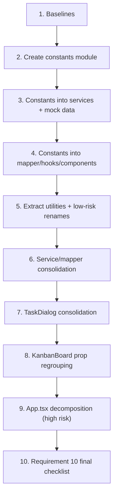

# Implementation Plan: Codebase Refactoring

## Overview

This plan converts the behavior-preserving refactoring design into incremental coding steps.
The implementation language is **TypeScript/React** (the existing codebase). Each step builds on
the previous one and ends by wiring the change into the app so no orphaned code remains.

Because there is **no test framework** and Requirement 10 forbids inventing one, verification is
done through `npm run build`, `npm run lint`, code review of preserved logic, and grep-based
leftover checks. These gates appear as explicit checkpoint tasks after every increment
(Requirement 9). Ordering goes lowest-risk first (constants, renames, utilities), then
service/mapper consolidation, then the high-risk `App.tsx` decomposition last.

> Note: no test sub-tasks are marked optional (`*`) because the design has no Correctness
> Properties section (PBT does not apply) and the build/lint/review gates are mandatory per
> Requirements 9 and 10.

## Task Dependency Graph



The chain is intentionally sequential: each step ends with a build+lint checkpoint, and later
steps consume the constants, utilities, renamed handlers, and consolidated services introduced by
earlier steps. The high-risk `App.tsx` decomposition (task 9) runs only after everything it depends
on is stable, and the final verification (task 10) runs last.

```json
{
  "waves": [
    { "wave": 1, "tasks": ["1"], "dependsOn": [] },
    { "wave": 2, "tasks": ["2"], "dependsOn": ["1"] },
    { "wave": 3, "tasks": ["3"], "dependsOn": ["2"] },
    { "wave": 4, "tasks": ["4"], "dependsOn": ["3"] },
    { "wave": 5, "tasks": ["5"], "dependsOn": ["4"] },
    { "wave": 6, "tasks": ["6"], "dependsOn": ["5"] },
    { "wave": 7, "tasks": ["7"], "dependsOn": ["6"] },
    { "wave": 8, "tasks": ["8"], "dependsOn": ["7"] },
    { "wave": 9, "tasks": ["9"], "dependsOn": ["8"] },
    { "wave": 10, "tasks": ["10"], "dependsOn": ["9"] }
  ]
}
```

## Tasks

- [x] 1. Capture pre-refactoring baselines
  - Record `App.tsx` line count via `(Get-Content src/App.tsx).Length` (expected baseline: 1721)
  - Run `npm run lint` and save the output as the warning/error baseline for later comparison
  - Run `npm run build` to confirm a clean starting point
  - _Requirements: 9.2, 10.2, 10.3_

- [x] 2. Create the constants module
  - [x] 2.1 Create `src/constants/` files and barrel
    - Create `board.ts` (`LIST_POSITION_STEP = 1000`, `DEFAULT_BOARD_TITLE = 'HVAC Editor'`)
    - Create `task.ts` (`TASK_PRIORITIES` as const tuple, `TaskPriority` type, `DEFAULT_TASK_PRIORITY = 'Low'`, `DEFAULT_TASK_CATEGORIES = { CATEGORY_1: 'Design', CATEGORY_2: 'Sprint' }`)
    - Create `focus.ts` (`STORAGE_KEYS`, `MAX_FOCUS_TASKS = 3`, `FOCUS_BUTTON_LABELS`)
    - Create `pomodoro.ts` (`POMODORO_MODES`)
    - Create `messages.ts` (`FOCUS_LIMIT_MESSAGE`, `ERROR_MESSAGES.INVALID_TEMPLATE`)
    - Create `commandPalette.ts` (`CommandPaletteActionConfig`, `COMMAND_PALETTE_ACTION_CONFIG`)
    - Create `index.ts` re-exporting all of the above
    - _Requirements: 1.1, 1.2, 1.3, 1.4, 1.5, 1.6, 1.7, 1.8, 1.9, 1.10, 1.11, 1.12, 1.13_

  - [x] 2.2 Checkpoint - build and lint
    - Run `npm run build` and `npm run lint`; resolve any error or new warning before continuing
    - _Requirements: 9.1, 9.2, 9.5_

- [x] 3. Wire constants into services and mock data
  - [x] 3.1 Replace `'HVAC Editor'` with `DEFAULT_BOARD_TITLE`
    - Update `board.service.ts` (mock `fetchBoards` title + `seedDefaultBoard` title)
    - Update `home.service.ts` `getLocalDashboardData` and `today.service.ts` `getLocalTodayData`
    - _Requirements: 1.11, 1.14, 9.6_

  - [x] 3.2 Replace position/priority/template literals in services
    - Replace `index * 1000` in `board.service.ts` `createBoardFromTemplate` with `index * LIST_POSITION_STEP`
    - Replace `'Low'` task defaults in `board.service.ts` seeding and `task.service.ts` with `DEFAULT_TASK_PRIORITY`
    - Replace thrown `'Please choose a starter template.'` with `ERROR_MESSAGES.INVALID_TEMPLATE` in `board.service.ts`
    - _Requirements: 1.2, 1.4, 1.13, 1.14_

  - [x] 3.3 Checkpoint - build and lint
    - Run `npm run build` and `npm run lint`; resolve findings before continuing
    - _Requirements: 9.1, 9.2, 9.5_

- [x] 4. Wire constants into mapper, hooks, and components
  - [x] 4.1 Update `boardDataMapper.ts` to use task constants
    - Use `TASK_PRIORITIES` in `normalizeTaskPriority`; use `DEFAULT_TASK_PRIORITY` and `DEFAULT_TASK_CATEGORIES` in the payload builders
    - _Requirements: 1.3, 1.4, 1.5, 1.14_

  - [x] 4.2 Update `useFocusTasks.ts` to use focus constants
    - Replace storage-key literals with `STORAGE_KEYS`, `maxFocusTasks = 3` with `MAX_FOCUS_TASKS`, and the inline limit string with `FOCUS_LIMIT_MESSAGE`
    - _Requirements: 1.6, 1.7, 1.8, 1.14, 8.3_

  - [x] 4.3 Update presentational components and mock data
    - `PomodoroModeSwitch.tsx` uses `POMODORO_MODES`; `HomeDashboard.tsx` uses `FOCUS_BUTTON_LABELS`; `TaskItem.tsx` priority list uses `TASK_PRIORITIES`; confirm `data.ts` board title references `DEFAULT_BOARD_TITLE` where applicable
    - Replace the four `FOCUS_LIMIT_MESSAGE` toast occurrences in `App.tsx`
    - _Requirements: 1.3, 1.8, 1.9, 1.10, 1.14_

  - [x] 4.4 Checkpoint - build and lint
    - Run `npm run build` and `npm run lint`; resolve findings before continuing
    - _Requirements: 9.1, 9.2, 9.5_

- [x] 5. Extract shared utilities and apply low-risk renames
  - [x] 5.1 Extract `createLocalId` to `src/utils/idGenerator.ts`
    - Move the function verbatim and import it into `TaskDialog.tsx`
    - _Requirements: 6.1, 6.5, 6.6_

  - [x] 5.2 Extract `formatFocusSessionDuration` to `src/utils/timeFormatting.ts`
    - Move the function verbatim and import it into `TaskDialog.tsx`
    - _Requirements: 6.2, 6.5, 6.6_

  - [x] 5.3 Add `getPriorityDotClass` to `src/utils/taskMetadata.ts` and use it in `TaskItem.tsx`
    - Replace the inline priority-color ternary with the helper, preserving the `bg-gray-400` fallback
    - _Requirements: 6.3, 6.5, 6.6_

  - [x] 5.4 Rename `resolveDestinationListId` to `findValidDestinationListId`
    - Rename the declaration and its single call site in `KanbanBoard.tsx` atomically
    - _Requirements: 7.2, 7.5, 7.6_

  - [x] 5.5 Rename `focusTasksWithLiveData` to `focusTasksWithCurrentBoardState`
    - Rename the `useMemo` value and all internal references in `useFocusTasks.ts` atomically
    - _Requirements: 7.3, 7.5, 7.6_

  - [x] 5.6 Checkpoint - build and lint
    - Run `npm run build` and `npm run lint`; grep to confirm no `resolveDestinationListId` or `focusTasksWithLiveData` remains
    - _Requirements: 9.1, 9.2, 9.5, 10.12_

- [x] 6. Consolidate service and mapper logic
  - [x] 6.1 Unify task normalization in `task.service.ts`
    - Introduce one shared coalescing source feeding `normalizeTaskData` (insert: all fields) and `normalizeTaskDataPartial` (update: only present keys); wire into `createTask`/`updateTask`
    - Verify by review that emitted keys/values match the original `buildStableTask*Payload` outputs
    - _Requirements: 3.2, 3.8, 3.9, 8.2_

  - [x] 6.2 Unify task defaults and remove dead code in `boardDataMapper.ts`
    - Introduce `applyTaskDefaults` used by `buildTaskInsertPayload`/`buildTaskUpdatePayload`; remove both `void attachments;` statements (and drop the now-unused param from the destructure)
    - _Requirements: 3.3, 3.4, 3.8_

  - [x] 6.3 Decompose `buildBoardDataFromRows`
    - Extract `buildChecklistItemsMap`, `buildLabelsMap`, `buildLabelTaskRelationships`; orchestrate from `buildBoardDataFromRows` preserving sort order and assembly
    - _Requirements: 3.6, 8.2_

  - [x] 6.4 Decompose `seedDefaultBoard` in `board.service.ts`
    - Extract `seedBoardLists` (returns listIdMap), `seedBoardTasks` (returns inserted tasks + details), `seedTaskDetails`; orchestrate preserving DB call order
    - _Requirements: 3.7, 8.2_

  - [x] 6.5 Consolidate localStorage reads in `useFocusTasks.ts`
    - Add a shared `readFromLocalStorage<T>(key, fallback, parse?)` and use it for both focus-task and active-id reads, preserving the SSR guard and parse fallback
    - _Requirements: 3.5, 8.3, 10.6_

  - [x] 6.6 Checkpoint - build and lint
    - Run `npm run build` and `npm run lint`; review consolidated payloads for value-identity
    - _Requirements: 9.1, 9.2, 9.5, 10.5_

- [x] 7. Consolidate TaskDialog state and effects
  - [x] 7.1 Consolidate draft state into `formDrafts`
    - Replace the five draft `useState`s with one `TaskFormDrafts` object and update input bindings
    - _Requirements: 4.2, 4.5_

  - [x] 7.2 Merge reset routines into `resetDialogState(mode)`
    - Replace `initializeDialogState`/`resetTransientDialogState` with one mode-aware function; update the open/close effects
    - _Requirements: 4.3, 4.5_

  - [x] 7.3 Consolidate add-item handlers via `addDraftItem`
    - Express the shared trim/validate/create-id/append/clear-draft pattern once; preserve the attachment URL validation
    - _Requirements: 4.4, 4.5_

  - [x] 7.4 Extract `useTaskActivityData` hook
    - Move activity-loading and focus-session-loading state/effects into the hook; consume it from `TaskDialog.tsx`; replace `priorityOptions` with `TASK_PRIORITIES`
    - _Requirements: 6.4, 6.5, 6.6, 1.3_

  - [x] 7.5 Checkpoint - build and lint
    - Run `npm run build` and `npm run lint`; review dialog open/close/submit behavior for equivalence
    - _Requirements: 9.1, 9.2, 9.5, 4.5_

- [x] 8. Regroup KanbanBoard props
  - [x] 8.1 Regroup `KanbanBoardProps` into `filters`/`ui`/`handlers`
    - Update the interface and all internal references (including `onBoardDataChange` -> `onBoardPositionChange`)
    - _Requirements: 5.1, 7.1_

  - [x] 8.2 Update the `App.tsx` call site to pass grouped objects
    - Pass `filters`, `ui`, and `handlers` so the rendered board and interactions are unchanged
    - _Requirements: 5.2, 8.1_

  - [x] 8.3 Checkpoint - build and lint
    - Run `npm run build` and `npm run lint`; review board rendering and drag/drop wiring
    - _Requirements: 9.1, 9.2, 9.5, 10.8_

- [x] 9. Decompose App.tsx into focused hooks (high risk)
  - [x] 9.1 Extract `useViewRouting`
    - Move `getInitialView`, `getInviteTokenFromPath`, `setActiveViewWithPath`, and the `popstate` effect; preserve path-to-view mapping
    - _Requirements: 2.2, 8.4, 10.7_

  - [x] 9.2 Extract `useBoardDataManagement`
    - Move board data/id/summaries/flags, cache sync, `refreshBoardData`/`refreshBoardList`, the fetch and cache-write effects, `useTaskRealtime`, `useDueDateReminder`
    - _Requirements: 2.1, 8.2, 8.3_

  - [x] 9.3 Extract `useTaskOperations` and consolidate position payloads
    - Move `onSubmitCard`, `onSubmitEditTask`, `handleDeleteConfirm`, `handleUpdateTask`, and the renamed `handleBoardPositionChange`; consolidate `buildChangedTaskPositionPayload`/`buildChangedListPositionPayload` behind a shared core using `LIST_POSITION_STEP`
    - _Requirements: 2.3, 3.1, 7.1, 7.5, 7.6, 10.8, 10.9_

  - [x] 9.4 Extract `useFocusTaskHandlers`
    - Move `getTaskListContext`, `buildFocusTaskInput`, `buildFocusTaskInputFromTodayTask`, and the four focus-toggle/start handlers; use `FOCUS_LIMIT_MESSAGE`
    - _Requirements: 2.4, 1.8, 10.10_

  - [x] 9.5 Extract `useCommandPaletteActions`
    - Build the action array from `COMMAND_PALETTE_ACTION_CONFIG` plus live `run` closures; preserve memo dependencies and the picture-in-picture conditional action
    - _Requirements: 2.5, 1.12_

  - [x] 9.6 Consolidate dialog state via `useAppDialogState`
    - Replace the six boolean dialog flags (and editing-task/active-list selection) with the structured object and open/close helpers; rewire `sharedDialogs` and call sites
    - _Requirements: 4.1, 4.5_

  - [x] 9.7 Remove `renderAppHeader` wrapper
    - Replace with an `AppHeaderWrapper` component (or inline conditional) at the three call sites; delete the function
    - _Requirements: 7.4, 7.5, 7.6_

  - [x] 9.8 Checkpoint - build, lint, and line count
    - Run `npm run build` and `npm run lint`; confirm `App.tsx` line count is below 1721
    - Review view selection, routing, CRUD, drag/drop, focus, auth/workspace/invite wiring for equivalence
    - _Requirements: 2.6, 2.7, 9.1, 9.2, 9.5, 10.3_

- [x] 10. Execute the Requirement 10 final-verification checklist
  - [x] 10.1 Build, lint, and line-count gates
    - `npm run build` passes; `npm run lint` passes with no new errors/warnings vs baseline; `App.tsx` < 1721 lines
    - _Requirements: 10.1, 10.2, 10.3_

  - [x] 10.2 Grep for leftover renamed identifiers
    - Confirm zero source hits for `handleBoardDataChange`, `resolveDestinationListId`, `focusTasksWithLiveData`, `renderAppHeader`, `onBoardDataChange`, and `priorityOptions`
    - _Requirements: 10.12, 7.5_

  - [x] 10.3 Grep for leftover inline constants
    - Confirm `'HVAC Editor'`, `1000` (excluding the documented `* 1000` ms conversions in `usePomodoroTimer.ts`), `kanban_focus_tasks`, `kanban_active_focus_task`, the priority array, the focus-limit message, the pomodoro modes array, and `'Focused'`/`'Focus'` labels are imported from `src/constants/` rather than redeclared inline
    - _Requirements: 10.4, 10.13_

  - [x] 10.4 Review-based behavioral equivalence sign-off
    - By code review and manual reasoning, confirm preservation of: Supabase payload shapes; localStorage keys/shapes; routing; list/task drag-and-drop; task CRUD; Focus Dock / Pomodoro / floating timer; and auth/workspace/members/invite flows
    - _Requirements: 10.5, 10.6, 10.7, 10.8, 10.9, 10.10, 10.11_

## Notes

- Each checkpoint enforces Requirement 9: a step is complete only when `npm run build` and
  `npm run lint` both pass.
- Renames (tasks 5.4, 5.5, 9.3, 9.7) are performed as atomic declaration-plus-references edits so
  the codebase never contains a partially renamed identifier (Requirements 7.5, 7.6, 9.6).
- The high-risk `App.tsx` decomposition (task 9) is intentionally last so it builds on already
  stable constants, utilities, renamed handlers, and consolidated services.
- Behavioral checks in task 10 are review/grep/build-based per Requirement 10 — no new test suite
  is created.
