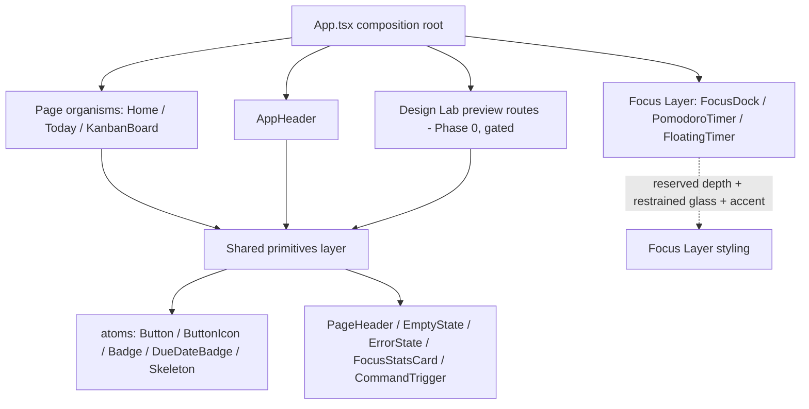

# Design Document — Quiet Velocity UI Redesign

> **Design language**: *Quiet Velocity UI* — **"Calm surface, decisive execution."**
> **Nature of this document**: a planning artifact. No production source is edited by writing it.
> It extends `docs/design-guidelines.md` (the living source of truth) and carries the HARD CONSTRAINTS
> from `docs/SESSION_HANDOFF.md` §4.
> **Verification model**: no automated test framework. Each implementation phase gates on
> `npm run build` (exit 0) + `npm run lint` (0/0) + code review + `hig-doctor` audit.
> **Originality**: every referenced product (Apple, Linear, Notion, Raycast, Superhuman, Jira, Trello)
> is an inspiration for **principles only**. No layout, palette, gradient, card style, typeface, motion
> signature, or product structure is copied. Quiet Velocity is expressed entirely in the app's own
> token set (slate neutral + blue/sky accent + documented semantic colors).

---

## Overview

Quiet Velocity UI is the named visual identity for a focus-first Kanban workspace whose thesis is to
help users **finish** tasks, not merely organize them. Its core idea — *calm surface, decisive
execution* — resolves a tension every productivity tool faces: the interface must be quiet enough to
think in, yet decisive enough to move you to action. Quiet Velocity answers this with one signature
concept, the **Focus Layer**: planning surfaces stay quiet (flat, low-chroma, hairline-bordered,
generous whitespace) while focus surfaces lift into an active layer (reserved depth shadow, restrained
glass, confident accent) so the "now" always reads as a distinct plane above the "later".

This document delivers eight things: (1) a product design diagnosis, (2) the Quiet Velocity design
system, (3) the UX principles the redesign must improve, (4) a component-level redesign plan, (5) a
phased implementation model, (6) per-phase acceptance criteria, (7) explicit non-goals, and (8) agent
execution rules. It is presentation-only and changes none of the HARD CONSTRAINT subsystems.

Quiet Velocity formalizes — rather than overrides — the existing `docs/design-guidelines.md`. Where the
guidelines already restrict glass and the heavy shadow to the Focus Dock and Floating Timer, Quiet
Velocity names that restriction the **Focus Layer** and makes it the product's identity.

---

## 1. Product design diagnosis

### 1.1 What the current UI does well

- **A genuine calm base already exists.** One neutral system (`slate-*`), one accent (`blue-600` /
  `sky-*`), and disciplined semantic intent colors (`emerald` done, `amber` due/warning, `rose`/`red`
  destructive/overdue). This is the right foundation for "calm."
- **Depth is already reserved meaningfully.** `--shadow-card` for ordinary surfaces; `--shadow-focus-surface`
  + `backdrop-blur` restricted to the Focus Dock and Floating Timer. The product already *implies* a
  Focus Layer — it just hasn't named or fully exploited it.
- **A real control contract is in place.** `Button`/`ButtonIcon` ship `cursor-pointer` + `focus-visible`
  ring + `disabled:cursor-not-allowed disabled:opacity-60`; icon-only controls carry `aria-label`;
  decorative SVGs carry `aria-hidden`. Recent phases added skeletons, error states with retry, empty
  states, undo-delete, NotFoundPage, ErrorBoundary, and an offline fallback.
- **Accessibility foundation is credible** — reduced-motion guard (CSS global + `useReducedMotion`),
  labelled dialogs, and a documented token system.

### 1.2 What still feels generic

- **Undifferentiated card styling.** Cards, list columns, stat tiles, and dashboard widgets share the
  same rounded-white-with-soft-shadow treatment, so nothing signals relative importance.
- **Flat information hierarchy on Home.** The dashboard presents assigned tasks, recent boards, and a
  holiday widget at roughly equal visual weight; the "what should I do now" answer is not foregrounded.
- **Decorative gradients/glass leak onto non-focus surfaces** (Auth/Today/Onboarding radial gradients,
  blur on headers/sidebars), diluting the Focus Layer signal that should be exclusive to focus surfaces.
- **Token drift.** One-off eyebrow trackings (`0.16/0.18/0.22/0.24/0.26em`) and arbitrary radii
  (`[1.35rem]`, `[1.5rem]`, `[2rem]`, `[32px]`, `[36px]`) undercut the sense of a single deliberate system.

### 1.3 What prevents the app from feeling distinctive

- **No named identity.** The UI reads as "a tidy generic SaaS" because it has no signature concept a
  user could describe. Quiet Velocity's **Focus Layer** is that missing signature.
- **Weak focus-first signaling.** Despite being a focus product, the "now / next" plane is not visually
  privileged over the "organize" plane.
- **First impression after login does not orient.** The landing surface shows data, but does not answer
  "what should I do in the next 25 minutes?" within a few seconds.

### 1.4 What must NOT be redesigned yet (risky — deferred)

| Deferred item | Why deferred |
|---|---|
| dnd-kit task-card DOM structure | Drag listeners live on the outer wrapper; restructuring risks breaking drag. Handled carefully and late (Phase 3), never as a rewrite. |
| Navigation-model unification (persistent rail, mobile nav) | HIGH-risk layout change touching every page and routing presentation. Out of scope for this redesign. |
| Full dialog focus-trap / Escape / return-focus | Modal-architecture rewrite. Remains deferred per existing guidelines. |
| Any HARD CONSTRAINT subsystem | Schema, auth, RLS, workspace/members/invite flow, CRUD, drag/drop, realtime, Focus/Pomodoro state, localStorage, routing, payloads — never touched. |

---

## 2. The Quiet Velocity design system

### 2.1 Design philosophy

> **Calm surface, decisive execution.**

1. **Quiet by default.** Planning and reading surfaces minimize chroma, shadow, and motion. The content
   is the interface; chrome recedes.
2. **The Focus Layer is the one place we raise our voice.** Active focus surfaces lift onto a distinct
   plane (depth + restrained glass + confident accent). The user should *feel* the difference between
   "organizing" and "doing."
3. **Velocity is decisiveness, not speed-lines.** Fast does not mean flashy — it means the next action
   is obvious and one keystroke/one click away. Keyboard-first command access reinforces this.
4. **One system, no drift.** Every value comes from the documented token set. No new hues, arbitrary
   radii, or stray gradients.

### 2.2 Color tokens

Built on the existing system; **no token meaning changes**, no decorative hues added.

| Role | Token family | Quiet Velocity use |
|---|---|---|
| Canvas | `slate-50` / `#F8F9FA` page bg, `white` surfaces | Quiet surfaces. The calm background is the "whitespace." |
| Neutral text | `slate-950/900` (titles), `slate-700/600` (body), `slate-500/400` (meta) | Single neutral ramp; legacy `gray-*` migrates to `slate-*` only when a file is already edited. |
| Primary accent | `blue-600` (actions) → `blue-700` (hover) | Reserved for decisive actions and the active focus accent. Used sparingly. |
| Focus ring / active | `sky-*` (`ring-sky-200/300`, `ring-blue-100` on blue contexts) | Focus-visible rings and active states. |
| Success / done | `emerald-*` | Completed state, positive confirmation. |
| Warning / due-today | `amber-*` | Due-today / caution. |
| Destructive / overdue | `rose-*` / `red-*` | Delete, error, overdue. |
| Hairline | `slate-200` (`/70`–`/80` for softness) | Borders on quiet surfaces. |

**Rule:** accent chroma is a budget. Quiet surfaces spend almost none; the Focus Layer is where blue
earns its keep.

### 2.3 Typography hierarchy

One family stack (system UI sans, as already shipped). Hierarchy by size/weight/tracking, not by
introducing new typefaces.

| Level | Spec | Use |
|---|---|---|
| Page title | `text-2xl`–`text-4xl`, `font-semibold`, `tracking-[-0.03em]`→`[-0.05em]`, `text-slate-950` | Hero/page headings. Tight tracking = the "decisive" voice. |
| Section heading | `text-sm`, `font-bold`, `uppercase`, `tracking-[0.2em]`, `text-slate-600` | In-card section labels. |
| Eyebrow (hero) | `text-[11px]`, `font-semibold`, `uppercase`, `tracking-[0.28em]`, `text-blue-600` | Page-level eyebrow above a title. |
| Eyebrow (section) | `tracking-[0.2em]` | Default eyebrow. Only these two trackings are allowed. |
| Body | `text-sm`, `leading-6`, `text-slate-500/600` | Default reading text. |
| Meta / caption | `text-xs` / `text-[11px]`, `text-slate-400/500` | Counts, timestamps, hints. |

### 2.4 Spacing scale

Tailwind 4px step system. Card padding `p-4`/`p-5`; section gaps `gap-4`/`gap-6`; page padding
`px-5 py-7` (mobile) → `sm:px-7`. **No new one-off pixel values** on touched surfaces.

### 2.5 Radius scale

Allowed: `rounded-md (6)`, `lg (8)`, `xl (12)`, `2xl (16, --radius-card)`, `3xl (24, --radius-panel)`,
`full`. Cards/controls/inputs → `2xl`; large panels/dialogs/drawers → `3xl`. **No new arbitrary radii**
(`[1.35rem]`, `[1.5rem]`, `[1.75rem]`, `[2rem]`, `[32px]`, `[36px]`); normalize existing ones when their
component is touched.

### 2.6 Border system

- Quiet surfaces: `1px` slate hairline (`border-slate-200`, `/70`–`/80` for softness).
- Empty/placeholder: dashed `border-slate-200`/`border-slate-300`.
- Avoid `border-white/80`-as-border on white (reads as glass trim) except on Focus Layer surfaces.

### 2.7 Shadow / elevation system (exactly two tiers)

| Tier | Token | Allowed on |
|---|---|---|
| Quiet | `--shadow-card` = `0 10px 28px rgba(15,23,42,0.07)` | All ordinary cards/surfaces. |
| Focus Layer | `--shadow-focus-surface` = `0 20px 60px rgba(15,23,42,0.25)` | **Only** Focus Dock + Floating Timer (and the focus session summary surface). |

Retire ad-hoc `shadow-[0_28px_90px…]`/`shadow-2xl` on ordinary content when touched. The drag-overlay
ghost may keep a strong transient shadow as an affordance (it is a drag artifact, not a resting surface).

### 2.8 Focus Layer rules (signature concept)

1. **Membership is closed.** Only the Focus Dock, Pomodoro timer, Floating Timer, FocusTaskMiniCard, and
   the focus session summary belong to the Focus Layer.
2. **Treatment:** `--shadow-focus-surface` + restrained `backdrop-blur` + a confident accent edge, so the
   surface reads as floating above the quiet plane.
3. **Exclusivity:** no quiet surface may adopt this treatment. New glass and the heavy shadow are
   forbidden elsewhere; existing leaks are normalized toward flat when a component is touched.
4. **Motion:** Focus Layer entrances/transitions may be slightly more expressive than quiet surfaces, but
   always reduced-motion gated.

### 2.9 Task-surface rules

- Readability first: title at `text-sm font-semibold text-slate-900`, truncation safe, metadata row
  below with consistent `Badge` tokens (priority, due-date, assignee).
- Quiet treatment: `--shadow-card`, slate hairline, `2xl` radius. No glass.
- **Preserve drag/drop structure**: drag listeners stay on the outer wrapper; any keyboard-open work
  happens on a separate inner element (Phase 3, carefully).
- Touch targets for nested actions trend toward 44×44px on mobile.

### 2.10 Dashboard-surface rules

- **Focus-first ordering.** The first thing visible answers "what should I do now?" — a focus/Today
  call-to-action precedes secondary widgets (recent boards, holidays).
- Reuse `SectionCard`/`Badge`/`PageHeader`; reduce decorative gradient/glass on widgets.
- Read-only views: never change the underlying data wiring or service calls.

### 2.11 Command-surface rules

- Keyboard-first: a header trigger styled like an input announces the shortcut affordance and opens the
  command palette. The palette is the fast path to "what next."
- Clarify command vs search **in presentation only**; no routing or action-config change.

### 2.12 Motion rules

- CSS animation/transition honors `prefers-reduced-motion: reduce` (global guard in `index.css`).
- Framer Motion honors reduce-motion per component via `useReducedMotion()`.
- Purposeful motion is kept but always has a reduced/instant alternative; quiet surfaces use minimal
  motion, Focus Layer surfaces may use slightly more.

### 2.13 Responsive rules

- Breakpoints: mobile 320px+, tablet 768px+, desktop 1024px+.
- No horizontal overflow at 320px; layouts reflow from multi-column (desktop) to single-column (mobile).
- Touch targets ≥44×44px on mobile.

### 2.14 Accessibility rules

- WCAG 2.1 AA contrast (≥4.5:1 normal text, ≥3:1 large text / meaningful UI).
- `focus-visible` ring on every interactive control; `aria-label` on icon-only controls; `aria-hidden`
  on decorative SVGs; semantic headings and landmarks on full-page surfaces (404/error/auth).
- `aria-live="polite"` for status changes (toasts, offline banner) where the system supports it.

---

## 3. UX principles the redesign must improve

| Principle | Current gap | Quiet Velocity improvement |
|---|---|---|
| First impression after login | Landing shows data, not a next action | Lead with a focus-first call-to-action ("Start your day / Plan focus") above secondary widgets; the Focus Layer cue draws the eye to "now." |
| Today / My Day clarity | Stat tiles and sections at uniform weight | `FocusStatsCard` + clear section hierarchy; due/overdue foregrounded; one obvious primary action (quick add / start focus). |
| Focus-first positioning | Focus surfaces visually similar to planning | Focus Layer makes focus surfaces a distinct elevated plane app-wide. |
| Task card readability | Dense, undifferentiated metadata | Consistent `Badge` tokens, calmer hierarchy (title → meta → actions), safe truncation, 44px targets. |
| Command / search clarity | Trigger under-communicated | Input-styled `CommandTrigger` with visible shortcut affordance; presentation-only clarification of command vs search. |
| Focus timer distinctiveness | Timer reads like any card | Reserved Focus Layer treatment (depth + restrained glass + accent) makes the timer unmistakably "active." |
| Empty / error / loading quality | Mixed copy and styling | One `EmptyState`/`ErrorState`/`Skeleton` system; calm copy; retry where useful; layout-stable skeletons. |
| Mobile usability | Touch targets and reflow uneven | ≥44px targets, single-column reflow, no overflow, drawers usable on small screens. |

---

## 4. Component-level redesign plan

Verb key: **keep** · **polish** (token/a11y/spacing only) · **redesign lightly** (rework a region, keep
component shape) · **redesign structurally** (change DOM/interaction; only where explicitly safe).

| Component | File(s) | Verdict | Justification / constraint |
|---|---|---|---|
| App shell | implicit layout across pages | polish | Apply the quiet canvas + Focus Layer rules; optional `AppShell` only if needed (YAGNI). No routing change. |
| Header | `layout/AppHeader.tsx` | polish | Normalize radii/eyebrows/focus rings; adopt `CommandTrigger`. No layout change. |
| Navigation | header nav / Home sidebar | keep (this redesign) | Navigation-model unification is the deferred HIGH-risk phase; only token polish here. |
| Home dashboard | `organisms/HomeDashboard.tsx` | redesign lightly | Focus-first reorder; reduce decorative glass/gradient; reuse primitives. Keep all data wiring + `role=button` row behavior. |
| Today page | `today/TodayPage.tsx` | redesign lightly | `FocusStatsCard`, normalize radii/gradient/eyebrows; keep grid + data. |
| Board columns | `organisms/KanbanBoard.tsx`, `task/TaskList.tsx` | polish | Keep `DndContext`/`SortableContext` untouched (HARD CONSTRAINT). Normalize background gradient + "Add group" radius; column hierarchy polish only. |
| Task cards | `task/TaskItem.tsx`, `task/TaskCard.tsx`, `today/TodayTaskCard.tsx` | redesign structurally (TaskItem only, late) | Align on shared `Badge`/radius/`slate-*`. `TaskItem` inner `div→button`/`role=button` keeping drag listeners on the OUTER wrapper; fallback to `role=button`+`tabIndex`+`onKeyDown`. |
| Task detail drawer | `organisms/dialog/TaskDialog.tsx` | polish | Token/a11y polish; full focus-trap stays deferred. No `useTaskActivityData`/payload change. |
| Focus Dock | `focus/FocusDock.tsx` | polish (Focus Layer) | Keep glass + `--shadow-focus-surface`; normalize `[2rem]`→`--radius-panel`; confirm reduce-motion gating. |
| Floating Timer | `focus/PomodoroTimer.tsx` + `useDocumentPictureInPicture` | polish (Focus Layer) | Same signature treatment; normalize `[1.35rem]`. Do not touch PiP/timer logic. |
| Command Palette | `command/CommandPalette.tsx`, `layout/CommandTrigger.tsx` | polish | Presentation/affordance polish; no action-config or routing change. |
| Members panel | `workspace/WorkspaceMembersDialog.tsx` | polish | Normalize radii; confirm reduce-motion gating. No invite/RLS/flow change. |
| Auth page | `auth/AuthPage.tsx` | redesign lightly | Normalize `[36px]`/gradients; unify inputs/buttons via primitives. Keep auth logic exactly. |
| Onboarding page | `onboarding/OnboardingPage.tsx` | redesign lightly | Same treatment as Auth; reuse `PageHeader`. Keep setup submit flow. |
| Empty states | `atoms/EmptyState.tsx` | keep + apply | One dashed pattern; apply consistently. |
| Error states | `atoms/ErrorState.tsx` | keep + apply | Calm copy + retry; dev-only details. |
| Skeletons | `atoms/skeleton/*` | keep + apply | Layout-stable, slate-only, reduced-motion aware. |
| Toasts | `react-toastify` usage + `UndoToast` | polish | Consistent tone; `aria-live` announce; real `<button>` actions. |
| Buttons | `atoms/Button.tsx` | polish | Add `danger` variant if missing; keep control contract. |
| Inputs | inputs across Auth/Members/Today | polish | Unify `rounded-2xl` + slate hairline + focus ring. |
| Badges | `atoms/Badge.tsx`, `DueDateBadge.tsx` | keep + apply | One `Badge` primitive driving priority/label/due/count via existing class logic. |

---

## 5. Implementation phases

Sequenced so each phase depends only on completed phases. Every phase keeps `npm run build` and
`npm run lint` green and runs `hig-doctor` where available.

| Phase | Scope | Depends on | Risk | Rollback note |
|---|---|---|---|---|
| **0. Design Lab (preview only)** | Add gated preview routes that render redesigned primitives/surfaces in isolation. No production behavior, default routing, or shipped surface changes. | — | **very low** | Delete preview routes/files; production untouched by construction. |
| **1. Shared surfaces** | App shell background; Header polish; PageHeader; Button/IconButton; EmptyState; ErrorState; Skeleton; Toast; Auth/Onboarding polish. | P0 | **low** | Primitives additive; per-file revert. |
| **2. Home & Today** | Focus-first dashboard; Today planning surface; focus stats; upcoming/due tasks; quick capture if present. | P1 | **medium** | Read-only views; revert per section; keep data wiring. |
| **3. Board & task cards** | Board hierarchy; column polish; task card readability; metadata/badges/actions; `TaskItem` inner `div→button` preserving drag/drop. | P1, P2 | **medium (dnd-kit)** | Manual drag QA gate; revert `TaskItem` to inner-div if drag regresses. |
| **4. Focus surfaces** | Focus Dock; Pomodoro; Floating Timer; FocusTaskMiniCard; focus session summary — apply Focus Layer consistently. | P1 | **medium** | Visual-only; verify PiP + timer still function. |
| **5. Final QA** | build; lint; hig-doctor; manual responsive pass; drag/drop pass; reduced-motion pass; update `docs/design-guidelines.md`. | P0–P4 | **low** | Audit/doc step; no functional change. |

> Ordering note: the dnd-kit-coupled card work (P3) lands after primitives and dashboards so it consumes
> finished `Badge`/`TaskCard` shapes and is reviewed in isolation from layout churn.

---

## 6. Per-phase acceptance criteria

Global gate (every phase): `npm run build` exits 0; `npm run lint` 0 errors / 0 warnings; no new
arbitrary radii, gradients, or glass outside Focus Layer surfaces.

### Phase 0 — Design Lab
- **Changes:** preview-only routes/components rendering redesigned surfaces in isolation.
- **Unchanged:** default routing, every production surface, all HARD CONSTRAINTS.
- **Validation:** `npm run build`, `npm run lint`, `hig-doctor` on new files.
- **Manual QA:** preview route renders; visiting the app normally is byte-identical to before; no new
  default route; production navigation unaffected.
- **Rollback risk:** negligible (additive; delete to revert).

### Phase 1 — Shared surfaces
- **Changes:** shell background, header polish, and the shared primitives (PageHeader, Button/IconButton,
  EmptyState, ErrorState, Skeleton, Toast) plus Auth/Onboarding polish.
- **Unchanged:** auth submit flow, routing, payloads; no new glass/gradient outside Focus Layer.
- **Validation:** `npm run build`, `npm run lint`, `hig-doctor`.
- **Manual QA:** every touched control has cursor-pointer + hover + focus-visible + disabled treatment;
  icon-only buttons have `aria-label`; AA contrast on header/hero text; reduced-motion honored.
- **Rollback risk:** low (per-file revert).

### Phase 2 — Home & Today
- **Changes:** focus-first dashboard reorder; Today stats via `FocusStatsCard`; due/upcoming hierarchy;
  quick capture surfacing if present.
- **Unchanged:** all `fetch*` service calls and data shapes; `role=button` row behavior; routing.
- **Validation:** `npm run build`, `npm run lint`, `hig-doctor`.
- **Manual QA:** first impression orients to "what to do now" within a few seconds; AA contrast on
  badges/text; reduced-motion honored on animated counters/cards; no new gradient/glass.
- **Rollback risk:** medium (revert per section).

### Phase 3 — Board & task cards
- **Changes:** board/column hierarchy polish; task card readability; `TaskItem` inner `div→button`.
- **Unchanged:** `DndContext`/`SortableContext`/sensors/collision; drag listeners stay on the OUTER
  wrapper; payloads; realtime.
- **Validation:** `npm run build`, `npm run lint`, `hig-doctor`.
- **Manual QA (drag gate):** reorder task within a list; move task across lists; reorder lists; drag
  overlay ghost — all still work. Inner element keyboard-operable (Tab focus, Enter/Space opens). Nested
  action buttons still `stopPropagation` and work by mouse + keyboard. Targets ≥44px.
- **Rollback risk:** medium (highest = dnd-kit; revert `TaskItem` to inner-div if drag regresses).

### Phase 4 — Focus surfaces
- **Changes:** apply Focus Layer (depth + restrained glass + accent) consistently to Dock/Pomodoro/
  Floating Timer/FocusTaskMiniCard/session summary; normalize their arbitrary radii.
- **Unchanged:** Focus/Pomodoro state machine; PiP logic; localStorage focus keys/shapes.
- **Validation:** `npm run build`, `npm run lint`, `hig-doctor`.
- **Manual QA:** PiP pop-out opens/closes; countdown, start/pause/reset, mode switch all function;
  spring/transitions reduced-motion gated; icon-only controls labelled; Focus Layer treatment appears
  on no quiet surface.
- **Rollback risk:** medium (visual-only; verify timer/PiP).

### Phase 5 — Final QA
- **Changes:** none functional; audit + `docs/design-guidelines.md` update.
- **Unchanged:** everything functional.
- **Validation:** full `hig_audit` on `src/`; `npm run build` exit 0; `npm run lint` 0/0.
- **Manual QA:** responsive pass (320/768/1024, no overflow, ≥44px targets); drag/drop pass;
  reduced-motion pass with OS setting on.
- **Rollback risk:** low.

### Cross-cutting accessibility checklist (each UI-touching phase)
- AA contrast (4.5:1 / 3:1); ≥44×44px touch targets on mobile; `focus-visible` rings everywhere;
  `aria-label` on icon-only buttons; `aria-hidden` on decorative SVGs; `prefers-reduced-motion` honored.

---

## 7. Non-goals

- **No backend changes.**
- **No database schema changes.**
- **No auth or RLS changes.**
- **No product feature expansion** (this is a visual/UX pass, not new capability).
- **No brand cloning** of Apple, Linear, Notion, Raycast, Superhuman, Jira, Trello, or any other product.
- **No full rewrite.**
- **No drag/drop rewrite.**

---

## 8. Agent execution rules

1. **Never redesign all pages at once.** One page/surface area per change unit.
2. **Never copy brand-specific UI** — principles only; Quiet Velocity uses the app's own token set.
3. **Always preserve existing behavior** — the HARD CONSTRAINTS are inviolable.
4. **Run `npm run build`** after each implementation phase.
5. **Run `npm run lint`** after each implementation phase.
6. **Run the `hig-doctor` audit** after each implementation phase where available.
7. **Keep changes reviewable and modular** — per-file/per-surface commits, each phase independently
   revertible; Phase 0 preview routes must be additive and gated.

---

## Architecture

No new architecture. Presentation-only. Existing structure preserved: `App.tsx` (thin composition root)
→ routing hook (`useViewRouting`) → page organisms (`HomeDashboard`, `TodayPage`, `KanbanBoard`) +
layout (`AppHeader`) → molecules/atoms. Quiet Velocity adds a thin **shared-primitive layer** between
atoms and pages so duplicated UI converges, plus a **Phase 0 design-lab** that renders previews behind
additive, gated routes.



Styling flows through Tailwind v4 `@theme` tokens in `src/index.css`; the redesign consumes existing
tokens (`--radius-card`, `--radius-panel`, `--shadow-card`, `--shadow-focus-surface`) and adds none that
override Tailwind defaults.

## Components and Interfaces

Pseudocode signatures only — no production code is written by this document.

```pascal
// Quiet vs Focus Layer surface selector — the one structural idea of Quiet Velocity.
INTERFACE SurfaceCard
  layer:   'quiet' | 'focus'          // default 'quiet'
  interactive?: boolean               // adds reduce-motion-gated hover/tap
  className?: string
  children: Node
// 'quiet' -> --shadow-card, slate hairline, NO blur
// 'focus' -> --shadow-focus-surface + restrained backdrop-blur + accent edge (Focus Layer ONLY)

INTERFACE FocusStatsCard
  label: string
  value: string
  caption?: string
// A 'quiet' SurfaceCard specialization for Today's three stats.

INTERFACE CommandTrigger
  onOpen: () => void
  shortcutHint: string                // e.g. "Ctrl K" — affordance only, no key remap
// Input-styled button that opens the existing Command Palette. No routing/action-config change.
```

## Data Models

No data model changes. The redesign reads existing view models (`ITaskItem`, board data, focus stats,
workspace summaries) exactly as today and renders them differently. No field is added, removed, renamed,
or retyped; no payload shape changes.

## Error Handling

Reuses the existing `ErrorState` (retry, dev-only technical details) and `ErrorBoundary` / NotFound /
offline-fallback surfaces. The redesign does not globally catch or hide Supabase errors and keeps retry
behavior intact. New surfaces fail visibly and calmly, never as a blank screen.

## Testing Strategy

No automated test framework exists; verification is **build + lint + code review + `hig-doctor` audit +
manual QA**. Each phase: run `npm run build` (exit 0) and `npm run lint` (0/0), run `hig_audit` on the
touched directory, then execute that phase's manual QA checklist — with explicit drag/drop and
reduced-motion passes for the phases that touch the board and focus surfaces.

## Correctness Properties

### Property 1: Behavior invariance
For identical user input, the app's data operations, payloads, routing outcomes, and persisted
localStorage shapes are identical before and after any phase.

**Validates: Requirements 10.1, 10.3, 10.5, 10.6, 10.7**

### Property 2: Focus Layer exclusivity
The reserved depth shadow and glass treatment appear only on Focus Layer surfaces; no quiet surface
carries them.

**Validates: Requirements 2.7, 2.8**

### Property 3: Token closure
Every shipped style value resolves to an allowed token (no new hue, no arbitrary radius, no stray
gradient outside Focus Layer).

**Validates: Requirements 2.2, 2.5, 6.6, 9.3**

### Property 4: Control-contract completeness
Every interactive control introduced or modified has cursor-pointer (enabled), hover, focus-visible,
disabled treatment, and — if icon-only — an `aria-label`.

**Validates: Requirements 2.14, 4.2**

### Property 5: Originality
No shipped surface reproduces a referenced product's signature layout, palette, gradient, card style,
typeface, motion signature, or structure.

**Validates: Requirements 9.1, 9.2, 9.3**

### Property 6: Gate satisfaction
After each phase, build exits 0 and lint reports 0/0 with no errors absent from the baseline.

**Validates: Requirements 6.6, 10.8**
