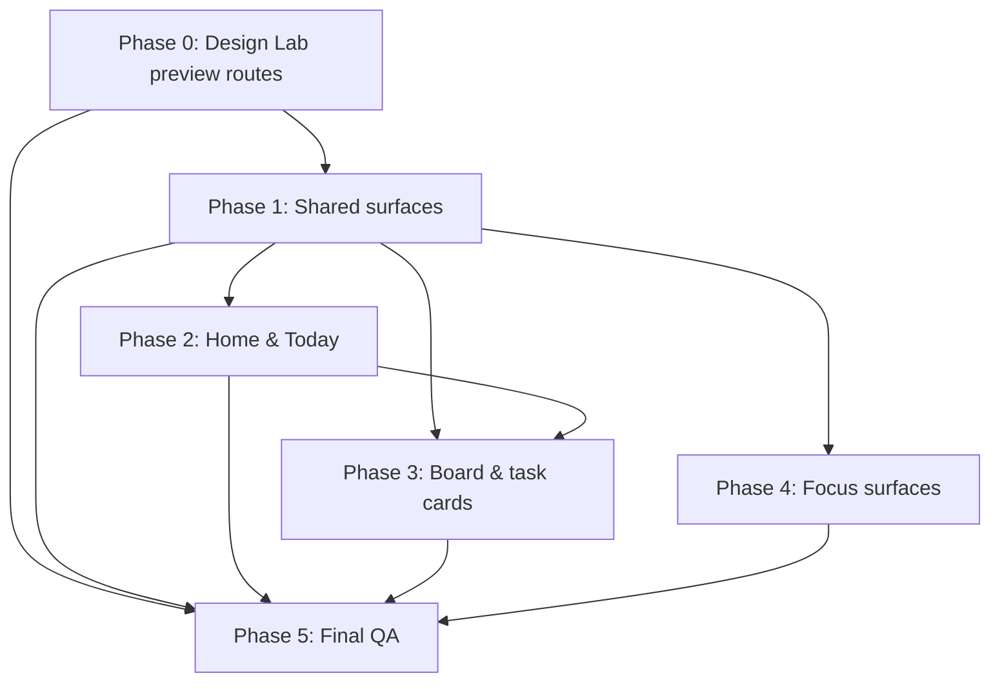

# Implementation Plan — Quiet Velocity UI Redesign

## Overview

Behavior-preserving, presentation-only redesign delivered in safe phases. Every implementation phase
gates on `npm run build` (exit 0) + `npm run lint` (0/0) + `hig-doctor` audit + manual QA. No HARD
CONSTRAINT subsystem is touched. One surface area per change unit; never all pages at once.

Verification model: no automated test framework — build + lint + review + `hig-doctor` + manual QA.

## Task Dependency Graph



```json
{
  "waves": [
    { "wave": 1, "tasks": ["0"] },
    { "wave": 2, "tasks": ["1", "1.1", "1.2", "1.3"] },
    { "wave": 3, "tasks": ["2", "2.1", "4"] },
    { "wave": 4, "tasks": ["3", "3.1", "3.2"] },
    { "wave": 5, "tasks": ["5"] }
  ]
}
```

Ordering: P0 first (additive, zero-risk). P1 unlocks everything else (primitives). P2 and P4 are
independent of each other but both depend on P1. P3 depends on P1+P2 (consumes finished primitives and
is reviewed away from layout churn). P5 is the final gate over all phases.

## Tasks

---

## Phase 0 — Design Lab (preview only)

- [ ] 0. Stand up a gated, preview-only design lab
  - Add additive preview route(s) that render redesigned primitives/surfaces in isolation, gated so the
    default routing and every production surface are unchanged.
  - Confirm visiting the app normally is byte-identical to before (no new default route).
  - _Requirements: 5.1, 6 (Phase 0), 8.1, 8.7, 10.6_
  - _Validation: `npm run build`, `npm run lint`, `hig-doctor` on new files_

---

## Phase 1 — Shared surfaces

- [ ] 1. Establish Quiet Velocity tokens + shell background in `docs/design-guidelines.md` and `index.css` (no override of Tailwind defaults)
  - _Requirements: 2.2, 2.4, 2.5, 2.6, 2.7, 9.3_
- [ ] 1.1 Polish the Header (normalize radii/eyebrows/focus rings; adopt CommandTrigger affordance)
  - _Requirements: 2.3, 2.11, 4.1, 3.5_
- [ ] 1.2 Generalize/confirm shared primitives: PageHeader, Button/IconButton (danger variant), EmptyState, ErrorState, Skeleton, Toast
  - Keep the control contract on every interactive element; reduced-motion aware skeletons.
  - _Requirements: 2.3, 2.14, 4.2, 4.4, 3.7_
- [ ] 1.3 Polish Auth and Onboarding (normalize arbitrary radii/gradients; unify inputs/buttons via primitives; keep auth/setup flow exactly)
  - _Requirements: 4.1, 9.2, 10.2_
  - _Phase gate: `npm run build`, `npm run lint`, `hig-doctor`; manual QA per design §6 Phase 1; rollback = per-file revert_

---

## Phase 2 — Home & Today

- [ ] 2. Reorder Home into a focus-first dashboard (next-action call-to-action above secondary widgets; reduce decorative glass/gradient; keep all data wiring + `role=button` rows)
  - _Requirements: 2.10, 3.1, 3.3, 4.1, 10.3_
- [ ] 2.1 Polish Today / My Day (FocusStatsCard, due/upcoming hierarchy, normalize radii/eyebrows; keep grid + data; surface quick capture if present)
  - _Requirements: 2.10, 3.2, 3.3, 4.1_
  - _Phase gate: `npm run build`, `npm run lint`, `hig-doctor`; manual QA = first-impression orients within seconds, AA contrast, reduced-motion, no new gradient/glass; rollback = per-section revert_

---

## Phase 3 — Board & task cards (preserve drag/drop)

- [ ] 3. Polish board + column hierarchy (normalize board background gradient + "Add group" radius; column readability; keep `DndContext`/`SortableContext` untouched)
  - _Requirements: 2.9, 4.1, 4.3, 10.3_
- [ ] 3.1 Improve task card readability (consistent Badge tokens, calmer title→meta→actions hierarchy, `slate-*` migration, ≥44px targets) across `TaskItem`/`TaskCard`/`TodayTaskCard`
  - _Requirements: 2.9, 3.4, 4.1, 4.4_
- [ ] 3.2 Make `TaskItem` keyboard-operable: inner `div→button`/`role=button` + Enter/Space, keeping drag listeners on the OUTER wrapper; nested action buttons keep `stopPropagation`
  - _Requirements: 2.9, 4.3, 10.3_
  - _Phase gate: `npm run build`, `npm run lint`, `hig-doctor`; manual DRAG QA (reorder in list / across lists / reorder lists / overlay ghost) + keyboard-open QA; rollback = revert `TaskItem` to inner-div if drag regresses_

---

## Phase 4 — Focus surfaces (Focus Layer)

- [ ] 4. Apply the Focus Layer consistently to Focus Dock, Pomodoro, Floating Timer, FocusTaskMiniCard, and the focus session summary (reserved depth + restrained glass + accent; normalize arbitrary radii); confirm exclusivity (no quiet surface gets the treatment)
  - Do NOT touch Pomodoro/Focus state machine, PiP logic, or focus localStorage keys/shapes.
  - _Requirements: 2.7, 2.8, 3.6, 4.1, 4.3, 10.4_
  - _Phase gate: `npm run build`, `npm run lint`, `hig-doctor`; manual QA = PiP pop-out + countdown/start/pause/reset/mode-switch function, reduced-motion gated, Focus Layer on no quiet surface; rollback = visual-only revert_

---

## Phase 5 — Final QA

- [ ] 5. Final audit + responsive/drag/reduced-motion passes + update `docs/design-guidelines.md`
  - Full `hig_audit` on `src/`; confirm no new arbitrary radii/gradients/glass outside Focus Layer.
  - Responsive pass (320 / 768 / 1024, no overflow, ≥44px targets); drag/drop pass; reduced-motion pass.
  - _Requirements: 2.13, 2.14, 6.6, 8.4, 8.5, 8.6, 10.8_
  - _Phase gate: `npm run build` exit 0; `npm run lint` 0/0; `hig_audit`; full manual QA_

---

## Notes

- This plan is presentation-only. The HARD CONSTRAINTS (schema, auth, RLS, workspace/members/invite,
  CRUD, drag/drop, realtime, Focus/Pomodoro state, localStorage, routing, payloads) are never changed.
- Borrow principles, never appearance. Quiet Velocity must be expressible in the app's own token set
  (slate neutral + blue/sky accent + documented semantic colors). No brand cloning.
- One surface area per change unit. Run build + lint + `hig-doctor` after each phase. Keep commits
  modular and each phase independently revertible.
