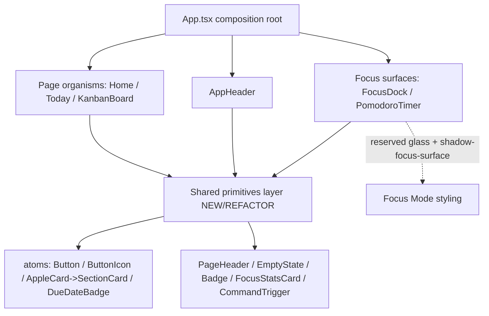

# Design Document: UI Redesign (Behavior-Preserving Visual/UX Pass)

> **Scope**: A visual/UX redesign of the existing React 19 + TS + Vite + Tailwind v4 (CSS `@theme`,
> no `tailwind.config`) + Supabase focus-first Kanban app. This is a **plan**, not code — no application
> source is edited as part of this document. It extends, not replaces, `docs/design-guidelines.md`
> (the living source of truth) and carries the HARD CONSTRAINTS from `docs/SESSION_HANDOFF.md` §4.
>
> **Verification model**: no automated test framework exists. Each phase gates on
> `npm run build` (exit 0) + `npm run lint` (0 errors / 0 warnings) + code review + `hig-doctor` audit.
>
> **Baseline (hig-doctor on `src/`)**: 6 critical / 7 serious / 735 positives, `gateTripped` at critical.
> Apple-native "hardcoded color / no dark mode" criticals are largely N/A for a web app; we use the
> audit for a11y/structure signal. Target: drive critical 6 → ≤3.

---

## Overview

This document is a concrete, phased **redesign plan** for a behavior-preserving visual/UX pass over the
focus-first Kanban app. The redesign anchors on a **Hybrid "Apple Calm + reserved Glass Focus Mode"**
direction (§1), formalizes the design system on top of the existing `@theme` tokens and
`docs/design-guidelines.md` (§2), assigns a per-page change verdict (§3), extracts a small set of
reusable primitives (§4), states the no-touch safety constraints (§5), sequences the work into seven
low-risk-first phases (§6), and defines checkable acceptance criteria per phase (§7).

The deliverable is the plan itself — **no application source code is changed by this document**. The
sections below (Overview → §1–§7 → Architecture / Components and Interfaces / Data Models / Error
Handling / Testing Strategy / Correctness Properties) form the complete design; the seven numbered
sections are the substance requested, and the trailing standard sections provide the minimal low-level
detail (primitive signatures), the explicit "no data model change" safety statement, and the
verification model.

---

## 1. Design direction

**Chosen direction: Hybrid — "Apple Calm" base + "Glass Focus Mode" reserved exclusively for the
Focus Dock and Floating Timer.**

### Why this fits a focus-first productivity product

| Candidate | Verdict | Reasoning |
|-----------|---------|-----------|
| Apple Calm | **Base** | Calm, low-chroma slate neutrals + a single blue/sky accent + generous spacing already match the product's "help users *finish*, not just organize" thesis. It is what the codebase is already drifting toward (`AppleCard`, slate palette, subtle `--shadow-card`). |
| Linear/GitHub Pro Tool | Borrow, don't adopt | We borrow its **control rigor** (consistent buttons, focus rings, dense-but-legible headers) without its dark, high-contrast, information-dense chrome — that would fight the "calm" goal. |
| Bento Productivity | Borrow for Home only | Bento tiling is useful for the Home dashboard's mixed widgets, but applying it app-wide adds visual noise. Treated as a *layout technique* on Home/Today, not a global identity. |
| Glass Focus Mode | **Accent surface only** | Glass/`backdrop-blur` + the heavy `--shadow-focus-surface` create a "this floats above your work" depth cue. That is exactly the signal the Focus Dock / Floating Timer should send — and nothing else should. |
| Pure single direction | Rejected | No single direction serves both the calm planning surfaces and the "elevated, always-on" focus surfaces. |

**This validates the existing guidelines rather than overriding them.** `docs/design-guidelines.md`
§3–4 already restricts glass/`backdrop-blur` and `--shadow-focus-surface` to the Focus Dock and
Floating Timer. The Hybrid direction simply names and formalizes that decision as the product's visual
identity: **calm and flat for thinking/planning; glassy and elevated for active focus.**

**One adjustment with reasoning**: the current code has glass/`backdrop-blur` leaking onto non-focus
surfaces (`AppHeader`, `HomeDashboard` sidebar, `TaskList`, `AppleCard`, `BoardEmptyState`, Today/Auth
sections). The direction implies these should trend toward flat/subtle over the phased rollout — but
per the guidelines we **do not rip blur out aggressively** (it touches layout-heavy areas); we stop
adding new glass and normalize opportunistically when a component is already being edited.

---

## 2. Design system decisions

All decisions **build on** `src/index.css` `@theme` tokens (`--radius-card: 1rem`,
`--radius-panel: 1.5rem`, `--shadow-card`, `--shadow-focus-surface`) and formalize the rules in
`docs/design-guidelines.md`. Nothing here contradicts those; it tightens and enumerates them.

| Decision | Rule | Notes / source |
|----------|------|----------------|
| **Spacing scale** | Use Tailwind's default 4px step scale. Card padding `p-4`/`p-5`; section gaps `gap-4`/`gap-6`; page padding `px-5 py-7` (mobile) → `sm:px-7`. Avoid one-off pixel values. | Matches existing Today/Home rhythm. |
| **Border radius** | `rounded-md (6) / lg (8) / xl (12) / 2xl (16) / 3xl (24) / full`. Cards/controls/inputs → `2xl` (`--radius-card`). Large panels/dialogs/drawers → `3xl`/`--radius-panel`. **No new arbitrary radii** (`[1.35rem]`, `[1.5rem]`, `[1.75rem]`, `[2rem]`, `[32px]`, `[36px]`). Normalize existing arbitrary radii when a component is touched. | guidelines §2 |
| **Shadow** | Two tiers only. `--shadow-card` (`0 10px 28px rgba(15,23,42,0.07)`) for ordinary cards/surfaces. `--shadow-focus-surface` (`0 20px 60px rgba(15,23,42,0.25)`) **only** on Focus Dock + Floating Timer. Retire ad-hoc `shadow-[0_28px_90px…]` / `shadow-2xl` on ordinary content when touched (drag-overlay ghost may keep a strong shadow as a transient affordance). | guidelines §3 |
| **Border** | `1px` slate hairline: `border-slate-200` (or `/70`–`/80` for softness) on light surfaces; dashed `border-slate-200`/`border-slate-300` for empty/placeholder states only. Avoid `border-white/80` as a "border" on white — it reads as glass trim; keep only where glass is intended (focus surfaces). | extends guidelines §1 |
| **Typography hierarchy** | Page title `text-2xl`–`text-4xl font-semibold tracking-[-0.03em]–[-0.05em] text-slate-950`. Section heading `text-sm font-bold uppercase tracking-[0.2em] text-slate-600`. Body `text-sm leading-6 text-slate-500/600`. Meta/caption `text-xs`/`text-[11px]`. Eyebrow uses the two standard trackings below. | extends guidelines §6 |
| **Button variants** | Single source: `atoms/Button.tsx`. Variants: `primary` (blue-600 → hover blue-700, white text), `secondary` (neutral surface + border), `outline` (white + slate border), `text` (transparent → hover tint), plus a planned `danger`/destructive (rose). Sizes `sm/md/lg`. All share base: `cursor-pointer` + `focus-visible:ring-4` + `disabled:cursor-not-allowed disabled:opacity-60`. | extends `atoms/Button.tsx` + guidelines §8 |
| **Card variants** | Generalize `AppleCard` into `SectionCard`: `flat` (default — `--shadow-card`, slate hairline, no blur), `interactive` (adds reduced-motion-gated hover/tap), `focus-surface` (glass + `--shadow-focus-surface`, **only** Focus Dock/Timer). | §4 below |
| **Badge variants** | One `Badge` primitive driving: priority (drives off `getPriorityBadgeClass`), label (`getTaskLabelClass`), due-date (wrap existing `DueDateBadge`), and neutral count/status pills. Shapes: `rounded-full px-2.5 py-0.5 text-[11px] font-semibold uppercase` baseline. | §4 below |
| **Input / search style** | Inputs: `rounded-2xl border border-slate-200 bg-white px-4 py-3 text-sm outline-none focus:border-blue-300 focus:ring-4 focus:ring-blue-100`. The header command/search trigger is a button styled like an input (see `CommandTrigger`, §4). | matches Auth/Onboarding inputs |
| **Modal / drawer style** | Center modal = `ContentDialog` (`role="dialog"`, `aria-modal`, `--radius-panel`, `--shadow-card`/elevated). Side drawer = right-anchored panel (Task Detail, Members) `rounded-l-[--radius-panel]`, spring slide-in, reduced-motion gated. **Backdrop**: solid/low-opacity slate scrim; blur on the scrim is allowed as a scrim effect, not a content surface. | extends guidelines §10 |
| **Focus (focus-visible) state** | Every interactive control: `focus:outline-none` + visible ring. Accent ring `focus-visible:ring-4 focus-visible:ring-sky-100` (or `ring-blue-100` on blue contexts); destructive uses `ring-rose-100`. Prefer `focus-visible` over `focus` on new/edited controls. | guidelines §8 |
| **Hover state** | Subtle and consistent: surface lift `hover:-translate-y-0.5` + shadow step **only** on genuinely elevated/clickable cards; color/bg shift (`hover:bg-slate-50/100`) on rows and ghost buttons. No hover scale on text links. Motion gated by reduce-motion. | guidelines §7–8 |
| **Disabled state** | Uniform: `disabled:cursor-not-allowed disabled:opacity-60` and no hover transform. Already in `Button`/`ButtonIcon` base. | guidelines §8 |

**Eyebrow tracking (formalized to two values)**: `tracking-[0.2em]` (section/default eyebrow),
`tracking-[0.28em]` (hero/page eyebrow). Existing one-offs (`0.16em`/`0.18em`/`0.22em`/`0.24em`/`0.26em`)
normalize to the nearest of these two when a component is touched.

---

## 3. Page redesign plan

Verb key: **keep as-is** · **polish only** (token/a11y/spacing cleanup, no structural change) ·
**redesign lightly** (rework a region/layout but keep the component shape) ·
**redesign structurally** (change the DOM/interaction structure).

| Page / component | File | Verdict | Justification |
|------------------|------|---------|---------------|
| App Header | `src/components/layout/AppHeader.tsx` | **polish only** | Structure is sound; normalize arbitrary radii→`2xl`, standardize focus rings, and extract the search button as `CommandTrigger`. No layout change. |
| Home Dashboard | `src/components/organisms/HomeDashboard.tsx` | **redesign lightly** | Reorder around a focus-first bento; reduce decorative gradients/glass on the holiday widget per direction; reuse `SectionCard`/`Badge`. Keep all data wiring and the existing `role=button` My-Tasks row behavior. |
| Today Page | `src/components/today/TodayPage.tsx` | **redesign lightly** | Strong already; convert stat cards to `FocusStatsCard`, normalize arbitrary radii (`[1.5rem]`/`[2rem]`) and the radial-gradient background, tighten eyebrow trackings. Layout grid stays. |
| Board Page | `src/components/organisms/KanbanBoard.tsx` | **polish only** | Keep the dnd-kit `DndContext`/`SortableContext` structure untouched (HARD CONSTRAINT). Normalize the board background gradient + the "Add group" arbitrary radius; no behavioral change. |
| Task Card | `src/components/task/TaskItem.tsx` (+ `TaskCard.tsx`) | **redesign structurally** | `TaskItem`: convert the clickable inner `<div>` → real `<button>`/`role=button` while keeping dnd-kit listeners on the OUTER wrapper (see §5). Normalize `[1.35rem]` radius, `gray-*`→`slate-*`, 44px targets. `TaskCard.tsx` (the simpler variant): polish or fold into the shared `TaskCard` primitive (§4). |
| Task Detail Drawer | `src/components/organisms/dialog/TaskDialog.tsx` | **polish only** | Visual/token/a11y polish; full focus-trap/Escape/return-focus stays **deferred** (modal-architecture rewrite, out of scope). No change to `useTaskActivityData` or payloads. |
| Focus Dock | `src/components/focus/FocusDock.tsx` | **polish only** | This is a signature glass surface — *keep* the blur + `--shadow-focus-surface`. Normalize the `[2rem]` radius to `--radius-panel`, confirm reduce-motion gating on the spring transitions. |
| Floating Timer | `PomodoroTimer.tsx` / `useDocumentPictureInPicture` | **polish only** | Apply the same signature glass treatment for visual consistency with the Dock; normalize `[1.35rem]` radius. Do **not** touch PiP logic or timer state. |
| Members Panel | `src/components/workspace/WorkspaceMembersDialog.tsx` | **polish only** | Already a clean right drawer with good a11y (`role=dialog`, labelled). Normalize radii (`[2rem]`/`[1.5rem]`), confirm reduce-motion gating; optionally factor the drawer chrome into `MembersDrawer`/shared drawer shell. No flow change (invites/RLS untouched). |
| Auth Page | `src/components/auth/AuthPage.tsx` | **redesign lightly** | Normalize `[36px]` radius + the radial/linear gradients (per "no new gradients" + trend-to-flat), unify inputs/buttons with primitives. Keep all auth logic/flows exactly. |
| Onboarding Page | `src/components/onboarding/OnboardingPage.tsx` | **redesign lightly** | Same treatment as Auth: normalize `[36px]` radius, gradient, and shadows; reuse input/button primitives and `PageHeader`. Keep the setup submit flow intact. |

---

## 4. Component extraction plan

Goal: DRY up duplicated patterns into a small primitive set. **YAGNI** — only extract what is
demonstrably duplicated today. Each item marked **NEW** or **REFACTOR-EXISTING**.

| Primitive | Status | Consolidates / source files | Notes |
|-----------|--------|------------------------------|-------|
| **AppShell** | NEW (low priority) | layout wrapper currently implicit across pages | Optional shell (header slot + content slot). Only build if Phase 2 layout work needs it; otherwise defer (YAGNI). Navigation-model unification is a separate HIGH-risk phase per SESSION_HANDOFF §5 — **not** in this redesign. |
| **AppHeader** | REFACTOR-EXISTING | `layout/AppHeader.tsx` | Keep; extract `CommandTrigger` + `UserMenu` (already separate). Token/a11y polish only. |
| **PageHeader** | NEW | eyebrow + title + subtitle + action block repeated in `TodayPage`, `HomeDashboard`, `AuthPage`, `OnboardingPage`, `BoardEmptyState` | Props: `eyebrow`, `title`, `description`, `actions?`. Standardizes hero typography + the two eyebrow trackings. |
| **SectionCard** | REFACTOR-EXISTING (generalize `AppleCard`) | `atoms/AppleCard.tsx`; surfaces in Today/Home/Members | Add `variant: 'flat' | 'interactive' | 'focus-surface'`. `flat` drops blur (calm direction); `focus-surface` carries the glass + `--shadow-focus-surface`. Preserve current `interactive` reduce-motion behavior. |
| **EmptyState** | NEW | dashed-empty blocks in `board/BoardEmptyState.tsx`, `today/TodayTaskSection.tsx` (empty), `TaskList` (no tasks), HomeDashboard ("No assigned tasks") | Props: `icon?`, `title`, `description?`, `action?`. One dashed-border empty pattern. |
| **Button variants** | REFACTOR-EXISTING | `atoms/Button.tsx`; ad-hoc `<button className="...bg-blue-600...">` in Today/Auth/Onboarding/Members | Add `danger` variant; migrate ad-hoc primary buttons to `Button` opportunistically. |
| **Badge** | NEW | priority/label/due/count pills duplicated in `TaskItem`, `TaskCard`, `HomeDashboard`, `TodayTaskCard` (all via `getPriorityBadgeClass` / `getTaskLabelClass`) | Thin presentational wrapper that takes a `tone` or precomputed class from `utils/taskMetadata`. Keeps the existing class logic (no behavior change), removes copy-paste. Wraps `DueDateBadge` as the due-date case. |
| **TaskCard** | REFACTOR-EXISTING | `task/TaskItem.tsx` (board), `task/TaskCard.tsx` (simpler), `today/TodayTaskCard.tsx` | Do **not** force a single mega-card. Align them on shared `Badge`/`DueDateBadge`/radius/`slate-*`. The board `TaskItem` keeps its dnd-kit wrapper + inline menus; the structural `div→button` work happens here (§5). |
| **FocusStatsCard** | NEW | the three stat tiles in `TodayPage` ("Today / Interruptions / Top focus") | Props: `label`, `value`, `caption`. A `SectionCard variant="flat"` specialization. |
| **CommandTrigger** | NEW | the header search/command button in `AppHeader.tsx` | Input-styled button that opens the Command Palette; standardizes the `Ctrl K` affordance + focus ring. Clarifies CommandPalette-vs-QuickSearch (presentation only; no routing change). |
| **UserMenu** | KEEP (exists) | `layout/UserMenu.tsx` | Already accessible (`aria-haspopup`, Escape, outside-click). Token polish only. |
| **MembersDrawer** | REFACTOR-EXISTING (optional) | `workspace/WorkspaceMembersDialog.tsx` | Optionally extract the right-drawer shell (backdrop + spring panel + header) shared with the Task Detail drawer. Only if it reduces real duplication; otherwise leave as-is (YAGNI). |

---

## 5. Safety constraints

**No changes** (carried verbatim from `docs/SESSION_HANDOFF.md` §4 — HARD CONSTRAINTS) to:

- **Backend / Supabase schema** — no table, column, or SQL changes.
- **Auth logic** — `useAuth`, sign-in/up, `AuthPage` submit flow unchanged.
- **RLS** — row-level security policies untouched.
- **Realtime sync** — `useTaskRealtime` and subscription behavior unchanged.
- **Drag/drop (dnd-kit)** — `DndContext`, `SortableContext`, sensors, collision strategy, `useSortable`/`useDroppable` wiring, and `handleDragStart/End/Cancel` logic unchanged.
- **Task data payloads** — `onUpdateTask` fields, `ITaskItem` shape, board data structure unchanged.
- **localStorage keys/shapes** — `STORAGE_KEYS` and persisted shapes unchanged.
- **Routing behavior** — `useViewRouting` and view transitions unchanged; redesign is presentation only.

Also unchanged: workspace/members/invite flow, Kanban CRUD, Focus Dock/Pomodoro state machine,
PiP (`useDocumentPictureInPicture`).

### dnd-kit coupling risk — `TaskItem.tsx` (the one structural change)

This is the highest-risk visual change and must preserve drag exactly. Current structure
(`TaskItem.tsx` ~L78–L100):

- **OUTER wrapper `<div>`** holds the drag contract: `ref={setNodeRef}` + spread `{...attributes}` +
  `{...listeners}` + transform/transition style.
- **INNER `<div onClick={handleEditTask}>`** is the click-to-open surface (the visible card body).

The refactor makes the **inner** element keyboard-operable (real `<button>` or `role="button"` +
`tabIndex={0}` + Enter/Space → open) **without moving the drag listeners off the outer wrapper**.
The two responsibilities stay on two separate elements:

```pascal
PROCEDURE TaskItem_structure(task, isOverlay)
  // OUTER element: owns the drag contract. DO NOT add onClick / role here.
  outer ← <div
            ref       = setNodeRef            // dnd-kit node
            style     = { transform, transition }
            {...attributes}                   // dnd-kit a11y attrs
            {...listeners}                     // dnd-kit pointer/keyboard drag listeners
          >

  // INNER element: owns click-to-open + keyboard-open. NO dnd-kit listeners here.
  inner ← <button type="button"               // was <div onClick=...>
            onClick   = openTaskDetail(task)
            // pointer drag still originates on OUTER via PointerSensor(distance:10);
            // a click that doesn't exceed the drag threshold falls through to onClick.
          >
            ...card body (badges, title, footer)...
          </button>

  RETURN outer( inner )
END PROCEDURE
```

**Why this works**: the `PointerSensor` activation constraint (`distance: 10`) means a press that
moves <10px is a click (handled by the inner button), and a press that moves ≥10px starts a drag
(handled by the outer wrapper's listeners). Nesting interactive elements requires care — the inner
control must `stopPropagation` on its own sub-buttons (priority/assignee/done/edit/delete) exactly as
today, and must not itself attach drag listeners. If a nested `<button>` proves problematic, the
fallback is `role="button"` + `tabIndex` + `onKeyDown` on the inner `<div>` (the pattern already used
successfully on the HomeDashboard My-Tasks row).

**`TaskList.tsx` grab handle (~L133)** is a **legitimate** drag handle (`cursor-grab`, title "Drag to
reorder list") — it is intentionally a div carrying `{...listeners}`. It stays a drag handle; we add an
`aria-label`/`role` affordance if the audit still flags it, but do not convert it to a click button.

**`HomeDashboard.tsx` My-Tasks row (~L307)** already has `role="button"` + `tabIndex` + Enter/Space
handling — it is compliant; keep as-is.

**`ContentDialog.tsx` backdrop (~L26)** is a flagged concern; full focus-trap/Escape/return-focus
remains **deferred** (modal architecture). Backdrop keeps `aria-hidden`; no scope creep here.

---

## 6. Implementation phases

Sequenced by dependency: primitives first (everything else consumes them), then header/layout, then the
medium-risk structural card work, then dashboards, then focus surfaces, then responsive, then the final
audit gate. **Every phase must keep `npm run build` and `npm run lint` green** (no test framework —
verification is build + lint + review + `hig-doctor`).

| Phase | Scope | Depends on | Risk | Rollback note |
|-------|-------|-----------|------|---------------|
| **1. Shared UI primitives + cursor/focus fixes** | Build/generalize `PageHeader`, `SectionCard` (from `AppleCard`), `EmptyState`, `Badge`, `FocusStatsCard`, `CommandTrigger`; add `Button` `danger` variant. Apply cursor/`focus-visible`/disabled contract gaps. No page restructuring. | — | **low** | Primitives are additive; until a page imports them nothing changes. Revert by deleting new files. |
| **2. AppHeader + page layout polish** | Adopt `CommandTrigger` in `AppHeader`; apply `PageHeader` to Today/Home/Auth/Onboarding; normalize radii/eyebrows/gradients on those shells. | P1 | **low–medium** | Per-file commits; revert any single page to prior markup without affecting others. |
| **3. Board / task card visual polish + `TaskItem` `div→button`** | Normalize Board/`TaskList`/`TaskItem`/`TaskCard` radii + `gray→slate`; the structural `TaskItem` inner `div→button` preserving dnd-kit (§5); bump task action targets toward 44px. **Clears the 3 remaining clickable-`div` criticals.** | P1, P2 | **medium** | Highest risk = dnd-kit. Manual drag QA gate (reorder within list, across lists, list reorder, overlay). Revert `TaskItem` to inner-`div` if drag regresses. |
| **4. Today / Home dashboard polish** | Apply `FocusStatsCard`, focus-first bento reorder on Home, reduce decorative glass/gradients on holiday widget; reuse `Badge`/`SectionCard`. | P1, P3 | **medium** | Dashboards are read-only views; revert per-section. Keep all `fetch*` service calls and `role=button` row behavior intact. |
| **5. Focus Dock / Floating Timer signature glass** | Apply the reserved glass + `--shadow-focus-surface` consistently; normalize their arbitrary radii to `--radius-panel`; confirm reduce-motion gating. **No** PiP/timer logic change. | P1 | **medium** | Visual-only; revert styling. Verify PiP pop-out + timer countdown still function (manual). |
| **6. Responsive pass** | Verify/repair breakpoints: mobile 320+, tablet 768+, desktop 1024+. Touch targets ≥44px on mobile; header/board/drawers usable on small screens. | P2–P5 | **medium** | CSS-class-level changes; revert per breakpoint/component. |
| **7. Final HIG audit + build/lint gate** | Full `hig_audit`; confirm critical ≤3; resolve stragglers; update `docs/design-guidelines.md` to reflect what landed. | P1–P6 | **low** | Audit/doc step; no functional change. |

> Ordering note: P3 (card structural change) is intentionally placed **after** primitives + header so it
> consumes the finished `Badge`/`TaskCard` shapes and is reviewed in isolation from layout churn. This
> matches SESSION_HANDOFF §5's recommendation to treat the dnd-kit-coupled card work as a discrete,
> carefully-reviewed unit.

---

## 7. Acceptance criteria

Concrete, checkable criteria **per phase**. Global gates (apply to *every* phase): `npm run build`
exits 0; `npm run lint` reports 0 errors / 0 warnings; no new arbitrary radii, gradients, or glass
introduced outside the Focus Dock / Floating Timer.

### Phase 1 — Primitives + control contract
- [ ] New primitives (`PageHeader`, `SectionCard`, `EmptyState`, `Badge`, `FocusStatsCard`, `CommandTrigger`) build and lint clean; each renders in isolation without runtime errors.
- [ ] `Button` `danger` variant carries `focus-visible:ring-4 focus-visible:ring-rose-100` + disabled contract.
- [ ] Every primitive's interactive element has `cursor-pointer`, a hover state, a `focus-visible` ring, and (where disable-able) `disabled:cursor-not-allowed disabled:opacity-60`.
- [ ] Icon-only controls expose `aria-label`; decorative SVGs carry `aria-hidden="true"`.
- [ ] No existing page imports changed yet → app behavior identical (visual diff limited to nothing).

### Phase 2 — Header + layout polish
- [ ] `AppHeader` uses `CommandTrigger`; `Ctrl K` affordance + focus ring present; command palette still opens.
- [ ] Today/Home/Auth/Onboarding use `PageHeader`; eyebrows normalized to `0.2em`/`0.28em`.
- [ ] Touched files: no arbitrary radii remain (`[36px]` etc. → `2xl`/`3xl`); no new gradients added.
- [ ] WCAG 2.1 AA contrast on all header/hero text: ≥4.5:1 (normal) / ≥3:1 (large).
- [ ] `prefers-reduced-motion` honored on any animated header/hero element.

### Phase 3 — Board / task card + `TaskItem` `div→button`
- [ ] **dnd-kit drag still works**: reorder task within a list, move task across lists, reorder lists, and drag-overlay ghost all function (manual QA).
- [ ] `TaskItem` inner element is keyboard-operable: Tab focuses it, Enter/Space opens the task detail; drag listeners remain on the OUTER wrapper.
- [ ] Nested action buttons (priority/assignee/done/edit/delete) still `stopPropagation` and work via mouse + keyboard.
- [ ] Task action touch targets ≥44×44px on mobile.
- [ ] `focus-visible` ring on the card and all nested controls; icon buttons keep `aria-label`; decorative SVGs `aria-hidden`.
- [ ] `[1.35rem]` radius normalized; `gray-*`→`slate-*` on touched task files.
- [ ] **`hig-doctor` critical count drops** (target: the 3 clickable-`div` concerns in `TaskItem` resolved).

### Phase 4 — Today / Home dashboard
- [ ] `FocusStatsCard` renders the three Today stats; values match prior data (no service change).
- [ ] Home My-Tasks row retains `role=button` + Enter/Space behavior; focus ring present.
- [ ] Decorative glass/gradients reduced on the holiday widget per direction; no new gradient/glass added.
- [ ] AA contrast on all dashboard text/badges; reduced-motion honored on `AnimatedDayCount` and card hover.

### Phase 5 — Focus Dock / Floating Timer
- [ ] Glass + `--shadow-focus-surface` applied **only** to these surfaces; arbitrary radii → `--radius-panel`.
- [ ] PiP pop-out opens/closes; Pomodoro countdown, start/pause/reset, mode switch all function (manual).
- [ ] Spring/transition animations gated by `useReducedMotion`; icon-only controls labelled.

### Phase 6 — Responsive
- [ ] Layout usable with no horizontal overflow at 320px, 768px, 1024px widths.
- [ ] All interactive controls ≥44×44px touch target on mobile.
- [ ] Header, board columns, drawers, and dialogs remain operable and readable at each breakpoint.

### Phase 7 — Final audit + gate
- [ ] `hig_audit` on `src/`: **critical reduced from 6 toward ≤3** (Apple-native color/dark-mode criticals noted as N/A for a web app).
- [ ] `npm run build` exit 0; `npm run lint` 0 errors / 0 warnings.
- [ ] No new arbitrary radii / gradients / glass outside Focus surfaces anywhere in the diff.
- [ ] `docs/design-guidelines.md` updated to reflect landed decisions (it remains the living source of truth — this design doc does **not** duplicate the full guideline).

### Cross-cutting accessibility checklist (verified each phase that touches UI)
- [ ] WCAG 2.1 AA contrast: 4.5:1 text / 3:1 large text and meaningful UI.
- [ ] 44×44px minimum touch targets on mobile.
- [ ] `focus-visible` rings on all interactive controls.
- [ ] `aria-label` on icon-only buttons; `aria-hidden="true"` on decorative SVGs.
- [ ] `prefers-reduced-motion` honored (CSS global guard + `useReducedMotion` for Framer Motion).

---

> **Living-doc note**: `docs/design-guidelines.md` is updated as each phase lands (tokens, control
> contract, and any newly-promoted primitive). This design document intentionally references those
> rules rather than restating them, to avoid drift between the two.

---

## Architecture

The redesign introduces **no new architecture** — it is presentation-only. The existing structure is
preserved: `App.tsx` (thin composition root) → routing hooks (`useViewRouting`) → page organisms
(`HomeDashboard`, `TodayPage`, `KanbanBoard`) and layout (`AppHeader`) → molecules/atoms. The redesign
adds a thin **shared-primitive layer** between atoms and pages so duplicated UI converges.



Styling continues to flow through Tailwind v4 `@theme` tokens in `src/index.css`; the redesign consumes
existing tokens (`--radius-card`, `--radius-panel`, `--shadow-card`, `--shadow-focus-surface`) and adds
none that would override Tailwind defaults.

## Components and Interfaces

Minimal low-level design. Only structural patterns that carry real risk or remove real duplication are
illustrated; these are **pseudocode signatures**, not production code (no code is written by this doc).

### SectionCard (generalize `AppleCard`)

```pascal
INTERFACE SectionCard
  variant: 'flat' | 'interactive' | 'focus-surface'   // default 'flat'
  className?: string
  children: Node
// 'flat'         -> --shadow-card, slate hairline, NO blur  (calm surfaces)
// 'interactive'  -> 'flat' + reduce-motion-gated hover/tap   (clickable cards)
// 'focus-surface'-> glass + --shadow-focus-surface           (Focus Dock / Timer ONLY)
```

### PageHeader / EmptyState / Badge / FocusStatsCard / CommandTrigger

```pascal
INTERFACE PageHeader      { eyebrow: string; title: string; description?: string; actions?: Node }
INTERFACE EmptyState      { icon?: Node; title: string; description?: string; action?: Node }
INTERFACE Badge           { tone | className: string; children: Node }   // wraps existing class logic
INTERFACE FocusStatsCard  { label: string; value: string; caption?: string }
INTERFACE CommandTrigger  { onOpen: () => void; shortcutHint?: string }  // input-styled button
```

### TaskItem drag/click separation (the one structural change)

See §5 for the full rationale and the `TaskItem_structure` pseudocode. The contract: drag listeners stay
on the OUTER wrapper (`setNodeRef` + `attributes` + `listeners`); click-to-open + keyboard-open move to
the INNER element (`<button>` or `role="button"` + `tabIndex` + Enter/Space). No dnd-kit listeners on
the inner element.

## Data Models

**No data model changes.** This is a HARD CONSTRAINT (§5). The redesign does not alter `ITaskItem`,
board data structures, `onUpdateTask` field payloads, `STORAGE_KEYS` / persisted localStorage shapes,
Supabase schema, or any service/DTO. All existing types and data flows are preserved exactly; the work
is limited to presentational markup and styling.

## Error Handling

No new error paths are introduced. Existing error/empty/loading states are **preserved in behavior** and
only restyled:

- **Loading / error banners** (Today, Home): same conditional rendering, restyled to tokens.
- **Empty states**: consolidated visually into `EmptyState` (dashed-border pattern); the conditions that
  trigger them are unchanged.
- **dnd-kit regression (Phase 3 risk)**: mitigated by keeping listeners on the outer wrapper and a manual
  drag-QA gate; rollback is reverting `TaskItem` to the inner-`div` form.
- **Reduced motion**: animations degrade to instant via the global CSS guard + `useReducedMotion`; no
  functional state is lost.

## Testing Strategy

The project has **no automated test framework** (per `docs/SESSION_HANDOFF.md`); inventing one is out of
scope. Verification for every phase is:

1. **Build gate** — `npm run build` (`tsc -b && vite build`) exits 0.
2. **Lint gate** — `npm run lint` (`eslint .`) reports 0 errors / 0 warnings.
3. **Code review** — against `docs/design-guidelines.md` (tokens + control contract).
4. **`hig-doctor` audit** — `hig_audit(src/)`; track critical count (target 6 → ≤3); used for
   a11y/structure signal (Apple-native color/dark-mode criticals noted N/A for a web app).
5. **Manual QA** — especially Phase 3 dnd-kit drag flows and Phase 5 PiP/timer flows.

## Correctness Properties

Expressed as invariants the redesign must uphold (checked via build/lint/review/audit/manual QA, since
no PBT framework exists):

### Property 1: Behavior preservation
For every page, the set of user-triggerable actions and their outcomes is identical before and after the
redesign — only presentation differs.

### Property 2: Drag invariance
For all task/list drag operations, post-redesign drag results equal pre-redesign results (within-list
reorder, cross-list move, list reorder, overlay ghost).

### Property 3: Keyboard operability
Every interactive control is reachable by Tab and operable by Enter/Space (or its native equivalent),
with a visible `focus-visible` ring.

### Property 4: Token conformance
No diff introduces an arbitrary radius, a new gradient, or glass/blur outside the Focus Dock / Floating
Timer.

### Property 5: Data immutability
No diff changes Supabase schema, RLS, auth, realtime, payloads, routing, or localStorage keys/shapes.

### Property 6: Motion accessibility
For `prefers-reduced-motion: reduce`, all animations degrade to instant while preserving end state.
